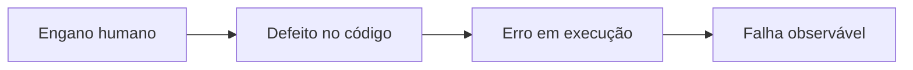
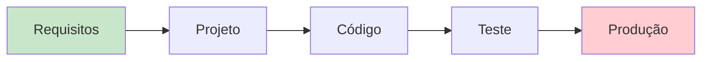

# Aula 01 — Qualidade de Software e Garantia da Qualidade (QA)

!!! info "Objetivos da aula"
    - Entender **o que é qualidade** de software e por que ela é difícil de medir.
    - Diferenciar **qualidade de produto** de **qualidade de processo**.
    - Compreender o papel da **Garantia da Qualidade (QA)** no ciclo de vida.
    - Distinguir **defeito, erro e falha**.

## Afinal, o que é "qualidade"?

Qualidade de software não é só "não ter bug". É o grau em que o produto atende às
**necessidades explícitas e implícitas** de quem o usa. Um sistema pode compilar,
passar em todos os testes e ainda assim ter *baixa qualidade* se for lento,
inseguro ou impossível de manter.

=== "Qualidade de Produto"
    Foca no **software entregue**: ele faz o que promete? É confiável, usável,
    eficiente e seguro? É o "resultado".

=== "Qualidade de Processo"
    Foca em **como o software foi feito**: o processo é previsível, repetível e
    melhora com o tempo? A ideia central: *bom processo tende a gerar bom produto*.

!!! quote "A premissa da qualidade de processo"
    "A qualidade de um sistema é fortemente influenciada pela qualidade do
    processo usado para desenvolvê-lo e mantê-lo." — princípio adotado por
    modelos como CMMI e MPS.BR (veremos na Aula 11).

## Defeito, erro e falha

Esses três termos são usados como sinônimos no dia a dia, mas em qualidade eles
têm significados distintos — e a prova cobra isso.

| Termo | O que é | Exemplo |
| :--- | :--- | :--- |
| **Defeito** *(defect/bug)* | Imperfeição no código-fonte | Um `>` que deveria ser `>=` |
| **Erro** *(error)* | Estado interno incorreto durante a execução | Uma variável com valor errado em memória |
| **Falha** *(failure)* | Comportamento observável incorreto | O sistema aprova um pedido que deveria recusar |



!!! warning "Nem todo defeito vira falha"
    Um defeito só se manifesta como falha se o trecho for **executado** com dados
    que exercitem o problema. Por isso testar é tão importante: encontramos
    defeitos *antes* que virem falhas em produção.

## QA, Controle de Qualidade e Teste

São coisas diferentes, embora relacionadas:

- **QA (Quality Assurance / Garantia):** atividades **preventivas** e de processo
  — padrões, revisões, auditorias. Pergunta: *"nosso processo produz qualidade?"*
- **QC (Quality Control / Controle):** atividades **de detecção** no produto —
  testes, inspeções. Pergunta: *"este produto está com qualidade?"*
- **Teste:** uma das técnicas de QC. Executa o software em busca de defeitos.

## Custo do defeito ao longo do tempo

Quanto mais tarde um defeito é encontrado, mais caro é corrigi-lo.



!!! tip "Regra prática"
    Corrigir um defeito em requisitos custa **centavos**; o mesmo defeito em
    produção pode custar **centenas de vezes mais**. QA existe para empurrar a
    detecção para a esquerda ("shift-left").

## Um primeiro olhar no código

Qualidade também aparece no código. Compare duas versões da mesma função:

=== "Baixa qualidade"
    ```java
    public double c(double v, int t) {
        return v * t * 0.1; // o que é isso?
    }
    ```

=== "Alta qualidade"
    ```java
    /** Calcula o desconto de fidelidade sobre o valor da compra. */
    public double calcularDescontoFidelidade(double valorCompra, int anosCliente) {
        final double TAXA_POR_ANO = 0.1;
        return valorCompra * anosCliente * TAXA_POR_ANO;
    }
    ```

## Exercícios

??? abstract "Exercício 1 — Classificando termos"
    Para cada situação, diga se é **defeito**, **erro** ou **falha**:

    1. O programador escreveu `if (idade > 18)` quando o requisito é "18 ou mais".
    2. Ao rodar, a variável `total` fica com `-5` em memória.
    3. O caixa eletrônico libera saque acima do saldo para o usuário.

??? abstract "Exercício 2 — Produto x Processo"
    Liste **duas** características de qualidade de **produto** e **duas** de
    **processo**. Explique, em uma frase cada, por que melhorar o processo pode
    melhorar o produto.

??? abstract "Exercício 3 — Shift-left"
    Explique, com suas palavras, por que encontrar defeitos cedo é mais barato.
    Dê um exemplo concreto de um defeito de **requisito** que ficaria caríssimo se
    só fosse descoberto em produção.

!!! tip "Próxima Parada 🚀"
    Coloque a mão na massa com a [**Lista 01 — Qualidade e QA**](../listas/01-lista.md).
    Na próxima aula veremos como o **DevOps e a Integração Contínua** automatizam a
    garantia da qualidade.
