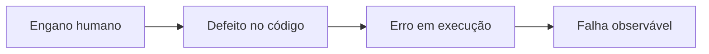
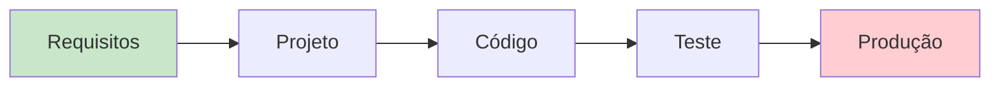

# Aula 01 — Qualidade de Software e Garantia da Qualidade (QA)

!!! info "Objetivos da aula"
    - Entender **o que é qualidade** de software e por que ela é difícil de medir.
    - Diferenciar **qualidade de produto** de **qualidade de processo**.
    - Compreender o papel da **Garantia da Qualidade (QA)** no ciclo de vida.
    - Distinguir **defeito, erro e falha**.

## Afinal, o que é "qualidade"?

Qualidade de software não é só "não ter bug". É o grau em que o produto atende às
**necessidades explícitas e implícitas** de quem o usa. Um sistema pode compilar,
passar em todos os testes e ainda assim ter *baixa qualidade* se for lento,
inseguro ou impossível de manter.

=== "Qualidade de Produto"
    Foca no **software entregue**: ele faz o que promete? É confiável, usável,
    eficiente e seguro? É o "resultado".

=== "Qualidade de Processo"
    Foca em **como o software foi feito**: o processo é previsível, repetível e
    melhora com o tempo? A ideia central: *bom processo tende a gerar bom produto*.

!!! quote "A premissa da qualidade de processo"
    "A qualidade de um sistema é fortemente influenciada pela qualidade do
    processo usado para desenvolvê-lo e mantê-lo." — princípio adotado por
    modelos como CMMI e MPS.BR (veremos na Aula 11).

### Por que melhorar o processo melhora o produto?

A ligação não é mágica: um processo maduro **remove defeitos mais cedo** e de
forma **repetível**. Se toda mudança passa por revisão (Aula 03) e por uma bateria
de testes automáticos (Aulas 07 e 08), a chance de um defeito chegar ao usuário
cai — não porque as pessoas ficaram mais cuidadosas, mas porque o processo
**captura o erro antes**. Alguns exemplos de como cada melhoria de processo
"vaza" para o produto:

| Melhoria de **processo** | Efeito no **produto** |
| :--- | :--- |
| Padrão de código + *lint* obrigatório | código mais legível e manutenível |
| Revisão de código em todo Pull Request | menos defeitos e melhores decisões de projeto |
| Testes automáticos no CI | menos regressões chegando em produção |
| Definição clara de "pronto" | menos funcionalidades incompletas entregues |

!!! tip "Guarde esta frase"
    *Qualidade não se testa no fim — se constrói no caminho.* O teste **revela** a
    qualidade que o processo **produziu** (ou deixou de produzir).

## Atributos de qualidade de produto

"Qualidade de produto" é abstrata demais para gerenciar. Por isso a quebramos em
**atributos** mensuráveis. A ISO/IEC 25010 (sucessora da ISO 9126, Aula 11)
organiza os principais:

- **Funcionalidade** — faz o que promete, com correção e completude.
- **Confiabilidade** — continua funcionando ao longo do tempo, tolera falhas.
- **Usabilidade** — é fácil de aprender e operar.
- **Eficiência (desempenho)** — usa bem tempo, memória e outros recursos.
- **Manutenibilidade** — é fácil de entender, corrigir e evoluir.
- **Portabilidade** — é fácil levar para outro ambiente.
- **Segurança** — protege dados e resiste a uso indevido.
- **Compatibilidade** — convive e troca informação com outros sistemas.

!!! example "Requisitos funcionais × não funcionais"
    - *Funcional:* "o sistema deve permitir transferência entre contas". Descreve
      **o que** o software faz.
    - *Não funcional (qualidade):* "a transferência deve concluir em até 2 s para
      95% das requisições". Descreve **quão bem** ele faz.

    A maioria dos atributos acima (confiabilidade, eficiência, segurança…) são
    **requisitos não funcionais** — e são justamente os mais esquecidos.

## Defeito, erro e falha

Esses três termos são usados como sinônimos no dia a dia, mas em qualidade eles
têm significados distintos — e a prova cobra isso.

| Termo | O que é | Exemplo |
| :--- | :--- | :--- |
| **Defeito** *(defect/bug)* | Imperfeição no código-fonte | Um `>` que deveria ser `>=` |
| **Erro** *(error)* | Estado interno incorreto durante a execução | Uma variável com valor errado em memória |
| **Falha** *(failure)* | Comportamento observável incorreto | O sistema aprova um pedido que deveria recusar |



!!! warning "Nem todo defeito vira falha"
    Um defeito só se manifesta como falha se o trecho for **executado** com dados
    que exercitem o problema. Por isso testar é tão importante: encontramos
    defeitos *antes* que virem falhas em produção.

A cadeia completa começa em uma **pessoa**:

1. **Engano (mistake):** um ser humano se equivoca — entendeu mal o requisito ou
   digitou errado.
2. **Defeito (defect/bug):** o engano vira um trecho incorreto no artefato (código,
   modelo, documento).
3. **Erro (error):** ao executar, o programa entra em um **estado interno**
   inválido (uma variável com valor errado).
4. **Falha (failure):** esse estado errado produz um **comportamento observável**
   incorreto para quem usa.

!!! note "Por que a distinção importa na prática"
    Ela guia **quem** age e **onde**: a falha é relatada pelo usuário/QA; a
    depuração (Aula 04) parte da falha, encontra o erro em execução e localiza o
    defeito no código para corrigir. Confundir os termos leva a corrigir o sintoma
    (a falha) sem remover a causa (o defeito).

## QA, Controle de Qualidade e Teste

São coisas diferentes, embora relacionadas:

- **QA (Quality Assurance / Garantia):** atividades **preventivas** e de processo
  — padrões, revisões, auditorias. Pergunta: *"nosso processo produz qualidade?"*
- **QC (Quality Control / Controle):** atividades **de detecção** no produto —
  testes, inspeções. Pergunta: *"este produto está com qualidade?"*
- **Teste:** uma das técnicas de QC. Executa o software em busca de defeitos.

## Custo do defeito ao longo do tempo

Quanto mais tarde um defeito é encontrado, mais caro é corrigi-lo.



!!! tip "Regra prática"
    Corrigir um defeito em requisitos custa **centavos**; o mesmo defeito em
    produção pode custar **centenas de vezes mais**. QA existe para empurrar a
    detecção para a esquerda ("shift-left").

Por que o custo cresce tanto? Um defeito de **requisito** descoberto em produção
não exige só corrigir uma linha: pode ser preciso **reprojetar**, **recodificar**,
**reescrever testes**, **reimplantar** e ainda lidar com o **dano já causado**
(clientes prejudicados, dados corrompidos, multas). O defeito não fica parado — ele
"contamina" tudo o que foi construído em cima dele.

!!! example "Um defeito de requisito caríssimo"
    O requisito dizia "aprovar empréstimo para renda **acima** de R$ 3.000", mas o
    analista entendeu "renda **de** R$ 3.000 ou mais". Se isso só é descoberto
    depois de meses em produção, milhares de contratos podem ter sido aprovados de
    forma indevida — com prejuízo financeiro e jurídico. Uma simples **revisão de
    requisitos** (Aula 03) teria custado alguns minutos.

### Custo da qualidade (CoQ)

Investir em qualidade tem custo — mas **não** investir custa mais. O modelo de
*Cost of Quality* separa:

- **Custos de conformidade** (prevenção + avaliação): treinamento, revisões,
  automação de testes. É o que você **paga para evitar** defeitos.
- **Custos de não conformidade** (falhas internas + externas): retrabalho, suporte,
  perda de clientes, danos à reputação. É o que você **paga por não ter evitado**.

O objetivo do QA é deslocar o gasto dos custos de **não** conformidade (caros e
imprevisíveis) para os de conformidade (baratos e planejáveis).

## Um primeiro olhar no código

Qualidade também aparece no código. Compare duas versões da mesma função:

=== "Baixa qualidade"
    ```java
    public double c(double v, int t) {
        return v * t * 0.1; // o que é isso?
    }
    ```

=== "Alta qualidade"
    ```java
    /** Calcula o desconto de fidelidade sobre o valor da compra. */
    public double calcularDescontoFidelidade(double valorCompra, int anosCliente) {
        final double TAXA_POR_ANO = 0.1;
        return valorCompra * anosCliente * TAXA_POR_ANO;
    }
    ```

## Exercícios

??? abstract "Exercício 1 — Classificando termos"
    Para cada situação, diga se é **defeito**, **erro** ou **falha**:

    1. O programador escreveu `if (idade > 18)` quando o requisito é "18 ou mais".
    2. Ao rodar, a variável `total` fica com `-5` em memória.
    3. O caixa eletrônico libera saque acima do saldo para o usuário.

??? abstract "Exercício 2 — Produto x Processo"
    Liste **duas** características de qualidade de **produto** e **duas** de
    **processo**. Explique, em uma frase cada, por que melhorar o processo pode
    melhorar o produto.

??? abstract "Exercício 3 — Shift-left"
    Explique, com suas palavras, por que encontrar defeitos cedo é mais barato.
    Dê um exemplo concreto de um defeito de **requisito** que ficaria caríssimo se
    só fosse descoberto em produção.

## Referências

**Leitura base**

- SOMMERVILLE, Ian. *Engenharia de Software*. 10. ed. São Paulo: Pearson, 2019 —
  cap. 24 (Gestão de qualidade).
- PRESSMAN, R. S.; MAXIM, B. R. *Engenharia de Software: uma abordagem
  profissional*. 8. ed. Porto Alegre: AMGH, 2016 — cap. sobre conceitos de
  qualidade.

**Normas e definições**

- ISO/IEC 25010:2011 — *Systems and software Quality Requirements and Evaluation
  (SQuaRE)*: modelo de qualidade de produto (atributos de qualidade).
- ISTQB — *Foundation Level Syllabus* e *Glossário* (definições de defeito, erro e
  falha): <https://www.istqb.org/>.

**Para aprofundar**

- CROSBY, P. B. *Quality is Free*. McGraw-Hill, 1979 — origem da ideia de "custo da
  qualidade".

!!! tip "Próxima Parada 🚀"
    Coloque a mão na massa com a [**Lista 01 — Qualidade e QA**](../listas/01-lista.md).
    Na próxima aula veremos como o **DevOps e a Integração Contínua** automatizam a
    garantia da qualidade.
