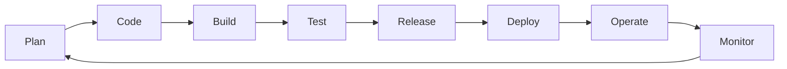
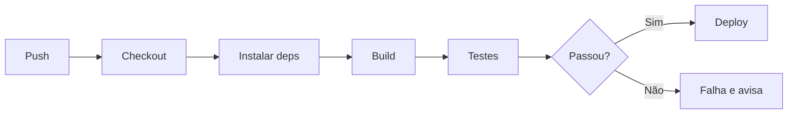

# Aula 02 — DevOps e Integração Contínua (CI/CD)

!!! info "Objetivos da aula"
    - Entender a cultura **DevOps** e o problema que ela resolve.
    - Compreender **Integração Contínua (CI)**, **Entrega Contínua** e **Implantação Contínua**.
    - Ler e escrever um **pipeline** simples com GitHub Actions.
    - Ver onde a **qualidade** entra no pipeline.

## O muro entre Dev e Ops

Historicamente, quem **desenvolvia** (Dev) jogava o software "por cima do muro"
para quem **operava** (Ops) colocar em produção. Resultado: atrito, culpa e
demora. **DevOps** derruba esse muro com **cultura + automação**: as mesmas
pessoas se responsabilizam por construir, testar e operar.



!!! quote "DevOps em uma frase"
    Reduzir o tempo entre "escrever uma mudança" e "ela estar rodando em produção
    com segurança", com **feedback rápido** a cada passo.

## CI, CD e CD (os três "contínuos")

=== "Integração Contínua (CI)"
    Cada `push` dispara **build + testes automáticos**. Se algo quebra, a equipe
    sabe em minutos. Evita o "inferno da integração" no fim do projeto.

=== "Entrega Contínua (Continuous Delivery)"
    Todo build que passa fica **pronto para implantar** a qualquer momento. A
    subida para produção é um **botão** (decisão humana).

=== "Implantação Contínua (Continuous Deployment)"
    Vai além: se passou em todos os testes, é implantado **automaticamente**, sem
    intervenção manual.

| Prática | Automatiza até... | Quem aperta o botão? |
| :--- | :--- | :--- |
| Integração Contínua | build + testes | ninguém (só valida) |
| Entrega Contínua | pacote pronto p/ deploy | uma pessoa |
| Implantação Contínua | produção | ninguém (automático) |

## Anatomia de um pipeline

Um **pipeline** é uma sequência de etapas automáticas. Se uma etapa falha, as
seguintes não rodam — e o defeito não avança.



## O pipeline deste site

O próprio site que você está lendo é publicado por CI/CD. Veja o coração do
`.github/workflows/ci.yml` (dois jobs, `build` e `deploy`):

```yaml
jobs:
  build:
    runs-on: ubuntu-latest
    steps:
      - uses: actions/checkout@v4
      - uses: actions/setup-python@v5
      - run: pip install -r requirements.txt
      - run: mkdocs build --strict   # falha se houver link quebrado

  deploy:
    needs: build                      # só roda se o build passar
    runs-on: ubuntu-latest
    steps:
      - uses: actions/deploy-pages@v4
```

!!! tip "Dois jobs, de propósito"
    Separar **build** de **deploy** evita re-publicar sem necessidade e evita o
    erro *"Multiple artifacts named github-pages"* ao re-executar o deploy.

## Onde a qualidade entra?

Um pipeline é o lugar natural para **automatizar QA**. Etapas comuns entre "build"
e "deploy":

- ✅ Testes unitários e de integração (Aulas 07 e 08)
- 🔍 Análise estática / *lint* (defeitos sem executar o código)
- 📊 Cobertura de testes (quanto do código foi exercitado)
- 🔒 Verificação de dependências vulneráveis

!!! example "Trecho de CI com Java"
    ```yaml
    - name: Rodar testes
      run: mvn test          # roda o JUnit e falha o pipeline se um teste quebrar
    ```

## Exercícios

??? abstract "Exercício 1 — Os três contínuos"
    Explique com suas palavras a diferença entre **Entrega Contínua** e
    **Implantação Contínua**. Dê um exemplo de sistema em que você **não** faria
    implantação automática e justifique.

??? abstract "Exercício 2 — Lendo um pipeline"
    No workflow deste site, por que o job `deploy` tem `needs: build`? O que
    aconteceria se removêssemos essa linha e o build falhasse?

??? abstract "Exercício 3 — Shift-left no pipeline"
    Cite **três** verificações de qualidade que você adicionaria ao pipeline entre
    o build e o deploy, explicando o que cada uma protege.

!!! tip "Próxima Parada 🚀"
    Automatize e publique na [**Lista 02 — CI/CD e DevOps**](../listas/02-lista.md).
    Na próxima aula: **técnicas de revisão e inspeção** — qualidade *antes* de rodar
    qualquer teste.
