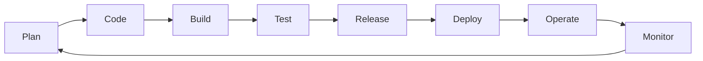
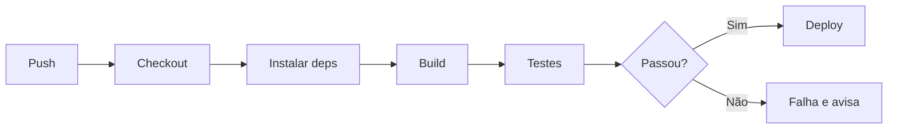
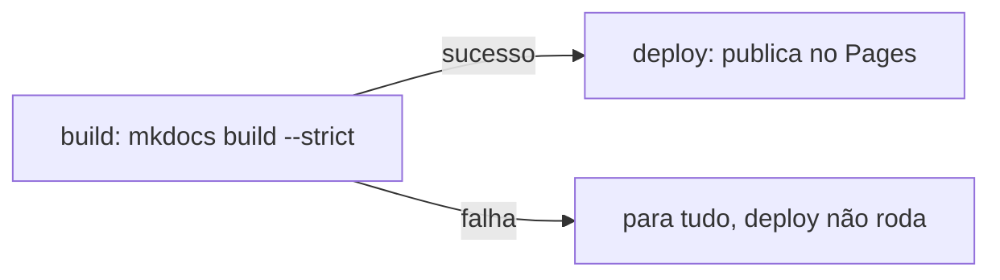

# Aula 02 — DevOps e Integração Contínua (CI/CD)

!!! info "Objetivos da aula"
    - Entender a cultura **DevOps** e o problema que ela resolve.
    - Compreender **Integração Contínua (CI)**, **Entrega Contínua** e **Implantação Contínua**.
    - Ler e escrever um **pipeline** simples com GitHub Actions.
    - Ver onde a **qualidade** entra no pipeline.

## O muro entre Dev e Ops

Historicamente, quem **desenvolvia** (Dev) jogava o software "por cima do muro"
para quem **operava** (Ops) colocar em produção. Resultado: atrito, culpa e
demora. **DevOps** derruba esse muro com **cultura + automação**: as mesmas
pessoas se responsabilizam por construir, testar e operar.



!!! quote "DevOps em uma frase"
    Reduzir o tempo entre "escrever uma mudança" e "ela estar rodando em produção
    com segurança", com **feedback rápido** a cada passo.

### DevOps é cultura, não uma ferramenta

Comprar um servidor de CI não faz uma empresa "ser DevOps". DevOps é um conjunto de
**valores e práticas**, frequentemente resumidos pela sigla **CALMS**:

- **C**ulture (Cultura) — responsabilidade compartilhada, sem "muro" entre times.
- **A**utomation (Automação) — automatizar build, teste, deploy e infraestrutura.
- **L**ean (Enxuto) — reduzir desperdício e entregar em lotes pequenos.
- **M**easurement (Medição) — medir tudo (Aula 10) para melhorar.
- **S**haring (Compartilhamento) — conhecimento e ferramentas abertos ao time.

!!! tip "Métricas DORA"
    Times DevOps medem seu desempenho por quatro indicadores clássicos (pesquisa
    *DORA*): **frequência de deploy**, **tempo de espera de mudança** (do commit ao
    produção), **taxa de falha de mudanças** e **tempo de restauração** após
    incidente. Os dois primeiros medem velocidade; os dois últimos, estabilidade.

## CI, CD e CD (os três "contínuos")

=== "Integração Contínua (CI)"
    Cada `push` dispara **build + testes automáticos**. Se algo quebra, a equipe
    sabe em minutos. Evita o "inferno da integração" no fim do projeto.

=== "Entrega Contínua (Continuous Delivery)"
    Todo build que passa fica **pronto para implantar** a qualquer momento. A
    subida para produção é um **botão** (decisão humana).

=== "Implantação Contínua (Continuous Deployment)"
    Vai além: se passou em todos os testes, é implantado **automaticamente**, sem
    intervenção manual.

| Prática | Automatiza até... | Quem aperta o botão? |
| :--- | :--- | :--- |
| Integração Contínua | build + testes | ninguém (só valida) |
| Entrega Contínua | pacote pronto p/ deploy | uma pessoa |
| Implantação Contínua | produção | ninguém (automático) |

!!! warning "Nem todo sistema deve ter implantação automática"
    A diferença entre Entrega e Implantação contínua é **quem decide subir**. Em
    sistemas de **alto risco ou regulados** — dispositivos médicos, aviônica,
    sistemas bancários *core*, votação eletrônica — costuma-se exigir uma
    **aprovação humana** (e às vezes auditoria) antes de ir para produção. Nesses
    casos, faz sentido parar na **Entrega Contínua**: o build fica pronto e
    validado, mas alguém responsável aperta o botão. Já um site de conteúdo ou um
    SaaS com bom monitoramento e *rollback* rápido é candidato natural à
    **Implantação Contínua**.

## Anatomia de um pipeline

Um **pipeline** é uma sequência de etapas automáticas. Se uma etapa falha, as
seguintes não rodam — e o defeito não avança.



## O pipeline deste site

O próprio site que você está lendo é publicado por CI/CD. Veja o coração do
`.github/workflows/ci.yml` (dois jobs, `build` e `deploy`):

```yaml
jobs:
  build:
    runs-on: ubuntu-latest
    steps:
      - uses: actions/checkout@v4
      - uses: actions/setup-python@v5
      - run: pip install -r requirements.txt
      - run: mkdocs build --strict   # falha se houver link quebrado

  deploy:
    needs: build                      # só roda se o build passar
    runs-on: ubuntu-latest
    steps:
      - uses: actions/deploy-pages@v4
```

!!! tip "Dois jobs, de propósito"
    Separar **build** de **deploy** evita re-publicar sem necessidade e evita o
    erro *"Multiple artifacts named github-pages"* ao re-executar o deploy.

### `needs`: dependência e *fail-fast*

A linha `needs: build` cria uma **dependência**: o job `deploy` só inicia **depois**
que `build` termina **com sucesso**. Isso implementa o princípio *fail-fast* — se o
build falha (por exemplo, um link quebrado detectado pelo `--strict`), o pipeline
**para ali** e o deploy **nunca roda**. O defeito não avança para produção.

E se removêssemos o `needs`? Os dois jobs passariam a rodar **em paralelo**, sem
relação de dependência. Um build quebrado **não impediria** o deploy — o site
poderia ser publicado a partir de um estado inconsistente (ou o deploy falharia por
não encontrar o artefato que o build deveria ter gerado). Ou seja: `needs` é o que
transforma dois jobs soltos em um **portão de qualidade** encadeado.



## Onde a qualidade entra?

Um pipeline é o lugar natural para **automatizar QA**. Etapas comuns entre "build"
e "deploy":

- ✅ Testes unitários e de integração (Aulas 07 e 08)
- 🔍 Análise estática / *lint* (defeitos sem executar o código)
- 📊 Cobertura de testes (quanto do código foi exercitado)
- 🔒 Verificação de dependências vulneráveis

Cada uma dessas etapas é um **quality gate** (portão de qualidade): uma verificação
que **bloqueia** o avanço se não for satisfeita. O que cada uma protege:

| Verificação | O que protege |
| :--- | :--- |
| Testes automáticos | comportamento correto; evita **regressões** |
| Análise estática / *lint* | defeitos e maus hábitos **sem executar** o código |
| Cobertura mínima de testes | evita mudança "sem teste" passar despercebida |
| *Scan* de dependências (ex.: `npm audit`, Dependabot) | bibliotecas com **vulnerabilidades** conhecidas |
| *Scan* de segredos | senhas/tokens commitados por engano |
| Build reprodutível (`--strict`) | artefato consistente; links/config quebrados |

!!! example "Trecho de CI com Java"
    ```yaml
    - name: Rodar testes
      run: mvn test          # roda o JUnit e falha o pipeline se um teste quebrar
    ```

!!! tip "Quanto mais cedo o portão, melhor"
    Ordene as etapas da **mais rápida/barata** para a **mais lenta/cara**: *lint* e
    testes unitários primeiro (segundos), integração e E2E depois (minutos). Assim o
    pipeline falha **rápido** no erro mais comum, dando feedback quase imediato —
    o *shift-left* da Aula 01 aplicado ao pipeline.

## Exercícios

??? abstract "Exercício 1 — Os três contínuos"
    Explique com suas palavras a diferença entre **Entrega Contínua** e
    **Implantação Contínua**. Dê um exemplo de sistema em que você **não** faria
    implantação automática e justifique.

??? abstract "Exercício 2 — Lendo um pipeline"
    No workflow deste site, por que o job `deploy` tem `needs: build`? O que
    aconteceria se removêssemos essa linha e o build falhasse?

??? abstract "Exercício 3 — Shift-left no pipeline"
    Cite **três** verificações de qualidade que você adicionaria ao pipeline entre
    o build e o deploy, explicando o que cada uma protege.

## Referências

**Leitura base**

- SOMMERVILLE, Ian. *Engenharia de Software*. 10. ed. Pearson, 2019 — cap. 25
  (Gestão de configuração / entrega contínua).
- HUMBLE, J.; FARLEY, D. *Continuous Delivery*. Addison-Wesley, 2010 — obra de
  referência sobre entrega e implantação contínua.

**Documentação oficial**

- GitHub Actions — documentação: <https://docs.github.com/pt/actions>.
- GitHub Pages Actions (deploy): <https://github.com/actions/deploy-pages>.

**Para aprofundar**

- FORSGREN, N.; HUMBLE, J.; KIM, G. *Accelerate*. IT Revolution, 2018 — base das
  métricas **DORA**.
- FOWLER, Martin. *Continuous Integration*:
  <https://martinfowler.com/articles/continuousIntegration.html>.

!!! tip "Próxima Parada 🚀"
    Automatize e publique na [**Lista 02 — CI/CD e DevOps**](../listas/02-lista.md).
    Na próxima aula: **técnicas de revisão e inspeção** — qualidade *antes* de rodar
    qualquer teste.
