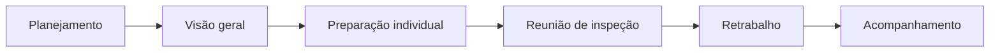
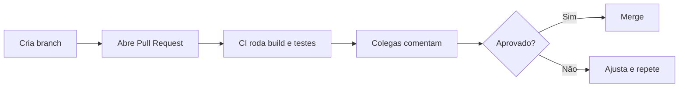

# Aula 03 — Técnicas de Revisão e Inspeção de Software

!!! info "Objetivos da aula"
    - Entender por que **revisar** encontra defeitos que o teste não encontra.
    - Diferenciar **revisão informal, walkthrough e inspeção formal**.
    - Conhecer os **papéis** e o fluxo de uma inspeção (Fagan).
    - Aplicar boas práticas de **code review** moderno (Pull Request).

## Por que revisar, se vamos testar?

Teste **executa** o código e observa o comportamento. Revisão **lê** o artefato
sem executá-lo — por isso é uma técnica **estática**. Ela encontra classes de
problemas que o teste dificilmente pega: requisitos ambíguos, código confuso,
falta de tratamento de erro, decisões de projeto ruins.

!!! success "Vantagem da revisão"
    Pode ser aplicada **antes de existir código executável** — em requisitos, no
    projeto, no diagrama. É o exemplo máximo de *shift-left* (Aula 01).

## Um espectro de formalidade

=== "Revisão Informal"
    Dois colegas olham o código juntos ("dá uma olhada aqui?"). Barata, rápida,
    sem registro. Boa para o dia a dia.

=== "Walkthrough"
    O autor **conduz** os revisores pelo artefato, explicando o raciocínio.
    Objetivo: entendimento e educação, além de achar defeitos.

=== "Inspeção Formal (Fagan)"
    Processo **rigoroso**, com papéis definidos, checklist, métricas e registro de
    defeitos. Mais cara, mas a que mais encontra defeitos por hora investida.

| Aspecto | Informal | Walkthrough | Inspeção |
| :--- | :--- | :--- | :--- |
| Formalidade | baixa | média | alta |
| Papéis definidos | não | parcial | sim |
| Registro/métricas | não | pouco | sim |
| Quem lidera | ninguém | o autor | o moderador |

## A inspeção de Fagan

Criada por Michael Fagan (IBM). Papéis principais:

- **Moderador:** conduz, mantém o foco (não deixa virar reunião de conserto).
- **Autor:** quem produziu o artefato (não se defende, ouve).
- **Leitor/Apresentador:** parafraseia o artefato para o grupo.
- **Revisores/Inspetores:** procuram defeitos.
- **Escriba:** registra os defeitos encontrados.



!!! warning "Regra de ouro da inspeção"
    A reunião **encontra** defeitos, não os **corrige**. Consertar ao vivo trava o
    grupo. O conserto acontece depois, na etapa de retrabalho.

## Code review moderno (Pull Request)

Hoje boa parte da revisão acontece de forma assíncrona no **Pull Request** do
GitHub/GitLab. É uma inspeção leve, apoiada por ferramentas.



!!! tip "Boas práticas de PR"
    - PRs **pequenos** (fáceis de revisar de verdade).
    - Descreva **o quê** e **por quê**, não só o "como".
    - Comente o **código**, não a **pessoa**.
    - Use **checklist** para não esquecer o básico.

## Checklist é aliado

Um bom checklist de revisão para código Java, por exemplo:

- [ ] Nomes claros e sem abreviações obscuras?
- [ ] Erros/exceções tratados nos limites certos?
- [ ] Há testes cobrindo o novo comportamento?
- [ ] Nenhum "número mágico" solto?
- [ ] Sem código morto ou comentado?

## Exercícios

??? abstract "Exercício 1 — Escolha a técnica"
    Para cada cenário, escolha entre informal, walkthrough e inspeção formal e
    justifique:

    1. Ajuste rápido de uma mensagem de erro.
    2. Módulo de cálculo de juros de um banco.
    3. Explicar a arquitetura de um serviço novo para o time.

??? abstract "Exercício 2 — Papéis de Fagan"
    Por que o **autor** não deve ser o **moderador** de sua própria inspeção?
    O que se perde?

??? abstract "Exercício 3 — Revisão na prática"
    Analise o trecho abaixo e liste **três** problemas que uma revisão apontaria:

    ```java
    public int calc(int a, int b) {
        int r = 0;
        r = a / b;
        return r;
    }
    ```

!!! tip "Próxima Parada 🚀"
    Pratique a revisão na [**Lista 03 — Revisão e Inspeção**](../listas/03-lista.md).
    A partir da próxima aula entramos em **teste de software** de verdade.
