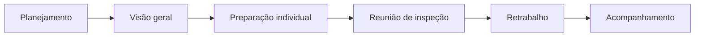
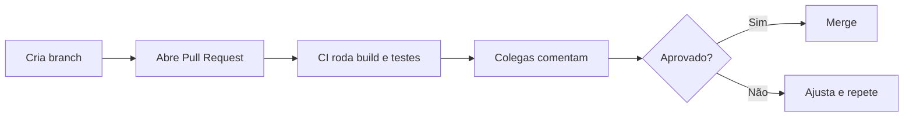

# Aula 03 — Técnicas de Revisão e Inspeção de Software

!!! info "Objetivos da aula"
    - Entender por que **revisar** encontra defeitos que o teste não encontra.
    - Diferenciar **revisão informal, walkthrough e inspeção formal**.
    - Conhecer os **papéis** e o fluxo de uma inspeção (Fagan).
    - Aplicar boas práticas de **code review** moderno (Pull Request).

## Por que revisar, se vamos testar?

Teste **executa** o código e observa o comportamento. Revisão **lê** o artefato
sem executá-lo — por isso é uma técnica **estática**. Ela encontra classes de
problemas que o teste dificilmente pega: requisitos ambíguos, código confuso,
falta de tratamento de erro, decisões de projeto ruins.

!!! success "Vantagem da revisão"
    Pode ser aplicada **antes de existir código executável** — em requisitos, no
    projeto, no diagrama. É o exemplo máximo de *shift-left* (Aula 01).

### Verificação estática × dinâmica

Toda técnica de qualidade cai em uma de duas famílias:

- **Estática:** examina o artefato **sem executá-lo**. Inclui revisões, inspeções
  e a **análise estática automatizada** (ferramentas como *linters*, SonarQube,
  SpotBugs, que leem o código em busca de padrões suspeitos).
- **Dinâmica:** **executa** o software e observa o comportamento — é o teste
  (Aulas 04 a 08).

As duas se complementam. A análise estática automatizada é ótima para achar
problemas **mecânicos** (variável não usada, possível `null`, complexidade alta);
a revisão humana é insubstituível para julgar **intenção e design** ("este código
resolve o problema certo?"). Um processo maduro usa as duas.

!!! example "O que só a revisão pega"
    Um teste confirma que `calcularFrete()` devolve o valor certo — mas **não** diz
    que o nome está confuso, que a regra de negócio foi mal interpretada, ou que
    faltou tratar o caso de CEP inexistente. Isso é trabalho de revisão.

## Um espectro de formalidade

=== "Revisão Informal"
    Dois colegas olham o código juntos ("dá uma olhada aqui?"). Barata, rápida,
    sem registro. Boa para o dia a dia.

=== "Walkthrough"
    O autor **conduz** os revisores pelo artefato, explicando o raciocínio.
    Objetivo: entendimento e educação, além de achar defeitos.

=== "Inspeção Formal (Fagan)"
    Processo **rigoroso**, com papéis definidos, checklist, métricas e registro de
    defeitos. Mais cara, mas a que mais encontra defeitos por hora investida.

| Aspecto | Informal | Walkthrough | Inspeção |
| :--- | :--- | :--- | :--- |
| Formalidade | baixa | média | alta |
| Papéis definidos | não | parcial | sim |
| Registro/métricas | não | pouco | sim |
| Quem lidera | ninguém | o autor | o moderador |

!!! tip "Como escolher a técnica: uma regra de bolso"
    Pese **risco** e **custo**. Quanto maior o impacto de um defeito passar, mais
    formal deve ser a revisão:

    - **Baixo risco / mudança trivial** (ajuste de texto, correção óbvia) →
      **informal** ou revisão de PR leve. Formalizar seria desperdício.
    - **Objetivo é disseminar conhecimento** (explicar um design novo ao time) →
      **walkthrough**, pois o foco é entendimento, não só achar defeitos.
    - **Alto risco / crítico** (cálculo financeiro, módulo de segurança, algoritmo
      central) → **inspeção formal**, que maximiza defeitos encontrados por hora.

## A inspeção de Fagan

Criada por Michael Fagan (IBM). Papéis principais:

- **Moderador:** conduz, mantém o foco (não deixa virar reunião de conserto).
- **Autor:** quem produziu o artefato (não se defende, ouve).
- **Leitor/Apresentador:** parafraseia o artefato para o grupo.
- **Revisores/Inspetores:** procuram defeitos.
- **Escriba:** registra os defeitos encontrados.



!!! warning "Regra de ouro da inspeção"
    A reunião **encontra** defeitos, não os **corrige**. Consertar ao vivo trava o
    grupo. O conserto acontece depois, na etapa de retrabalho.

### Por que separar os papéis?

A separação de papéis existe para garantir **objetividade** e **foco**. O caso mais
importante: o **autor não deve moderar** a própria inspeção. Quando alguém revisa o
próprio trabalho, tende ao **viés de confirmação** — enxerga o que quis dizer, não o
que de fato escreveu. Se ainda por cima **conduz** a reunião, dois problemas
surgem:

- **Conflito de interesse:** é natural (mesmo sem querer) minimizar ou "explicar"
  os próprios defeitos em vez de registrá-los.
- **Perda de neutralidade:** o moderador precisa manter o foco e um clima seguro,
  julgando o **artefato**, não a **pessoa**. O autor emocionalmente ligado ao código
  não consegue esse distanciamento.

O que se perde é justamente o principal valor da inspeção: um **olhar externo e
imparcial**. Por isso o autor **participa** (esclarece dúvidas), mas **ouve** — não
defende nem lidera.

## Code review moderno (Pull Request)

Hoje boa parte da revisão acontece de forma assíncrona no **Pull Request** do
GitHub/GitLab. É uma inspeção leve, apoiada por ferramentas.



!!! tip "Boas práticas de PR"
    - PRs **pequenos** (fáceis de revisar de verdade).
    - Descreva **o quê** e **por quê**, não só o "como".
    - Comente o **código**, não a **pessoa**.
    - Use **checklist** para não esquecer o básico.

## Checklist é aliado

Um bom checklist de revisão para código Java, por exemplo:

- [ ] Nomes claros e sem abreviações obscuras?
- [ ] Erros/exceções tratados nos limites certos?
- [ ] Há testes cobrindo o novo comportamento?
- [ ] Nenhum "número mágico" solto?
- [ ] Sem código morto ou comentado?

### Categorias comuns de defeito que uma revisão encontra

Ter categorias em mente ajuda a revisar de forma sistemática, não aleatória:

| Categoria | Exemplos típicos |
| :--- | :--- |
| **Robustez / casos-limite** | divisão por zero, `null`, lista vazia, *overflow* |
| **Entrada não validada** | dados do usuário usados sem checagem |
| **Legibilidade** | nomes ruins (`a`, `r`, `calc`), método longo demais |
| **Tratamento de erro** | exceção engolida, erro silencioso, sem *log* |
| **Regra de negócio** | fronteira errada (`>` vs `>=`), requisito mal interpretado |
| **Manutenibilidade** | número mágico, duplicação, código morto |

!!! example "Revisando um trecho pequeno"
    ```java
    public int calc(int a, int b) {
        int r = 0;
        r = a / b;   // e se b == 0? → ArithmeticException
        return r;
    }
    ```
    Só nessas quatro linhas uma revisão apontaria: (1) **risco de divisão por zero**
    quando `b == 0`; (2) **nomes obscuros** (`calc`, `a`, `b`, `r` não dizem nada);
    (3) a variável `r` é **inicializada e imediatamente sobrescrita** (linha inútil).
    Nenhum desses pontos exige *executar* o código.

## Exercícios

??? abstract "Exercício 1 — Escolha a técnica"
    Para cada cenário, escolha entre informal, walkthrough e inspeção formal e
    justifique:

    1. Ajuste rápido de uma mensagem de erro.
    2. Módulo de cálculo de juros de um banco.
    3. Explicar a arquitetura de um serviço novo para o time.

??? abstract "Exercício 2 — Papéis de Fagan"
    Por que o **autor** não deve ser o **moderador** de sua própria inspeção?
    O que se perde?

??? abstract "Exercício 3 — Revisão na prática"
    Analise o trecho abaixo e liste **três** problemas que uma revisão apontaria:

    ```java
    public int calc(int a, int b) {
        int r = 0;
        r = a / b;
        return r;
    }
    ```

## Referências

**Leitura base**

- SOMMERVILLE, Ian. *Engenharia de Software*. 10. ed. Pearson, 2019 — cap. 24
  (revisões e inspeções).
- PRESSMAN, R. S.; MAXIM, B. R. *Engenharia de Software*. 8. ed. AMGH, 2016 —
  cap. sobre revisões de software.

**Artigo clássico**

- FAGAN, M. E. *Design and code inspections to reduce errors in program
  development*. IBM Systems Journal, 1976 — origem da inspeção formal.

**Para aprofundar**

- Google — *Code Review Developer Guide*:
  <https://google.github.io/eng-practices/review/>.
- GitHub Docs — *About pull request reviews*:
  <https://docs.github.com/pt/pull-requests>.

!!! tip "Próxima Parada 🚀"
    Pratique a revisão na [**Lista 03 — Revisão e Inspeção**](../listas/03-lista.md).
    A partir da próxima aula entramos em **teste de software** de verdade.
