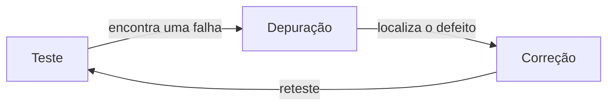
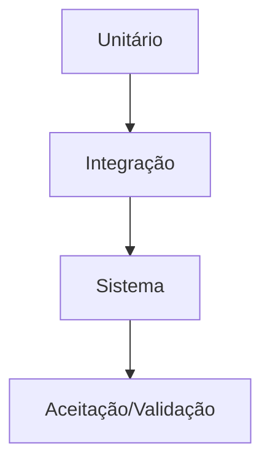

# Aula 04 — Fundamentos e Estratégias de Teste

!!! info "Objetivos da aula"
    - Entender **o que é** e **para que serve** o teste de software.
    - Conhecer os **princípios** do teste (por que testar tudo é impossível).
    - Diferenciar **verificação** de **validação**.
    - Ter a visão geral das **estratégias** e da relação teste × depuração.

## O que é testar (e o que não é)

Testar é **executar** o software com a intenção de **encontrar defeitos**. Um bom
teste é aquele que tem **alta chance de revelar um defeito ainda desconhecido**.

!!! quote "Dijkstra"
    "O teste pode mostrar a **presença** de defeitos, mas nunca a sua **ausência**."

Ou seja: passar em todos os testes não prova que o software é perfeito — prova que
os defeitos que **procuramos** não estão lá.

## Sete princípios do teste

??? note "Clique para ver os 7 princípios (ISTQB)"
    1. Teste mostra presença de defeitos, não ausência.
    2. **Teste exaustivo é impossível** — foque no que importa.
    3. **Teste cedo** economiza (shift-left).
    4. Defeitos se **agrupam** (poucos módulos concentram a maioria).
    5. **Paradoxo do pesticida:** repetir os mesmos testes para de achar defeitos novos.
    6. Teste **depende do contexto** (um jogo ≠ um sistema hospitalar).
    7. A ausência de erros é uma **ilusão** se o software não atende à necessidade.

Vale detalhar dois que caem muito em prova:

!!! warning "Princípio 4 — Agrupamento de defeitos (*defect clustering*)"
    Na prática, um número pequeno de módulos concentra a **maioria** dos defeitos
    (uma leitura da regra de Pareto: ~80% dos defeitos em ~20% do código).
    Consequência prática: vale **priorizar** o esforço de teste onde os defeitos
    historicamente se agrupam — código complexo, recém-alterado ou muito acoplado.

!!! warning "Princípio 5 — Paradoxo do pesticida"
    Assim como uma praga cria resistência a um pesticida usado sempre igual,
    **rodar sempre os mesmos testes** deixa de encontrar defeitos novos: eles só
    confirmam que os bugs já corrigidos continuam corrigidos. Para combatê-lo é
    preciso **revisar e renovar** os casos de teste — adicionar novos cenários,
    variar dados, cobrir código novo. Uma suíte que nunca muda vira apenas uma rede
    de proteção contra regressões, não um caçador de defeitos.

!!! warning "Teste exaustivo é impossível"
    Uma função que soma dois `int` de 32 bits tem $2^{32} \times 2^{32} \approx
    1{,}8 \times 10^{19}$ combinações de entrada. Testar todas levaria séculos.
    Por isso precisamos de **técnicas** para escolher poucos casos que valem por
    muitos (Aulas 05 e 06).

## Verificação × Validação

Dois conceitos que caem em prova e vivem confundidos:

=== "Verificação"
    *"Estamos construindo o produto **corretamente**?"*
    Conferimos se o software está de acordo com a **especificação**. Ex.: revisões,
    testes de unidade.

=== "Validação"
    *"Estamos construindo o produto **certo**?"*
    Conferimos se o software atende à **necessidade real** do usuário. Ex.: teste
    de aceitação com o cliente.

| | Verificação | Validação |
| :--- | :--- | :--- |
| Pergunta | Certo do jeito certo? | Certo o produto certo? |
| Referência | Especificação | Necessidade do usuário |
| Quando | Ao longo do desenvolvimento | Perto/depois da entrega |
| Exemplos | revisões, testes de unidade e integração | teste de aceitação, beta com usuários |

!!! tip "Um jeito de nunca mais confundir"
    - **Verificação → especificação.** Ambas começam com o mesmo som. Pergunto:
      *"construí conforme o documento?"*
    - **Validação → valor para o usuário.** Pergunto: *"isso resolve o problema
      real de quem vai usar?"*

    É possível **passar na verificação e falhar na validação**: o software cumpre a
    especificação à risca, mas a especificação estava errada — construímos
    corretamente o produto **errado**. Por isso as duas são necessárias.

## Teste × Depuração (debugging)

Não são a mesma atividade:



- **Teste**: revela que **existe** um problema (uma falha).
- **Depuração**: descobre **onde** está o defeito e o corrige.

Onde uma acaba e a outra começa? O **teste termina** no momento em que uma falha é
**observada** (um assert falha, um resultado sai errado). A partir daí começa a
**depuração**: formular hipóteses, reproduzir a falha, isolar o trecho, encontrar o
defeito e corrigi-lo. Depois da correção vem o **reteste** — rodar de novo o mesmo
caso para confirmar que a falha sumiu — e, idealmente, um **teste de regressão**
para garantir que nada mais quebrou.

!!! example "Um ciclo curto de ponta a ponta"
    1. **(Teste)** Rodo `deveCalcularDesconto()` → o assert falha: esperava `90`,
       veio `100`. *Aqui o teste fez seu papel: achou uma falha.*
    2. **(Depuração)** Investigo, coloco um *breakpoint*, descubro que a taxa estava
       como `0` em vez de `0.1`. *Localizei o defeito.*
    3. **(Correção)** Ajusto a constante.
    4. **(Reteste)** Rodo o mesmo teste de novo → passa. *Fim do ciclo.*

    O teste **aponta** o problema; a depuração o **explica e conserta**.

## Estratégia geral: do menor ao maior

A estratégia clássica organiza o teste em níveis, começando pequeno e crescendo
(veremos em detalhe na Aula 08):



!!! example "Meu primeiro caso de teste"
    Um **caso de teste** define entrada, ação e resultado esperado:

    ```java
    @Test
    void deveRejeitarIdadeNegativa() {
        var cadastro = new Cadastro();
        assertThrows(IllegalArgumentException.class,
            () -> cadastro.definirIdade(-1));
    }
    ```

## Exercícios

??? abstract "Exercício 1 — Verificação ou validação?"
    Classifique:

    1. Rodar os testes unitários no CI.
    2. Cliente usar o sistema por uma semana e dar feedback.
    3. Conferir se o código segue a especificação de requisitos.

??? abstract "Exercício 2 — Paradoxo do pesticida"
    Explique o que é o paradoxo do pesticida e cite **uma** forma de combatê-lo na
    prática.

??? abstract "Exercício 3 — Teste x depuração"
    Descreva um cenário curto (3–4 passos) que comece com um teste falhando e
    termine com um reteste passando. Diga onde acaba o teste e começa a depuração.

## Referências

**Leitura base**

- MYERS, G. J.; SANDLER, C.; BADGETT, T. *The Art of Software Testing*. 3. ed.
  Wiley, 2011 — definição clássica de teste e depuração.
- SOMMERVILLE, Ian. *Engenharia de Software*. 10. ed. Pearson, 2019 — cap. 8
  (Teste de software; verificação e validação).

**Normas e definições**

- ISTQB — *Foundation Level Syllabus* (sete princípios do teste, V&V):
  <https://www.istqb.org/>.

**Para aprofundar**

- DIJKSTRA, E. W. *Notes on Structured Programming*, 1972 — origem da frase sobre
  presença × ausência de defeitos.

!!! tip "Próxima Parada 🚀"
    Consolide os fundamentos na [**Lista 04 — Estratégias de Teste**](../listas/04-lista.md).
    Na próxima aula abrimos a "caixa": o **teste de caixa branca**.
