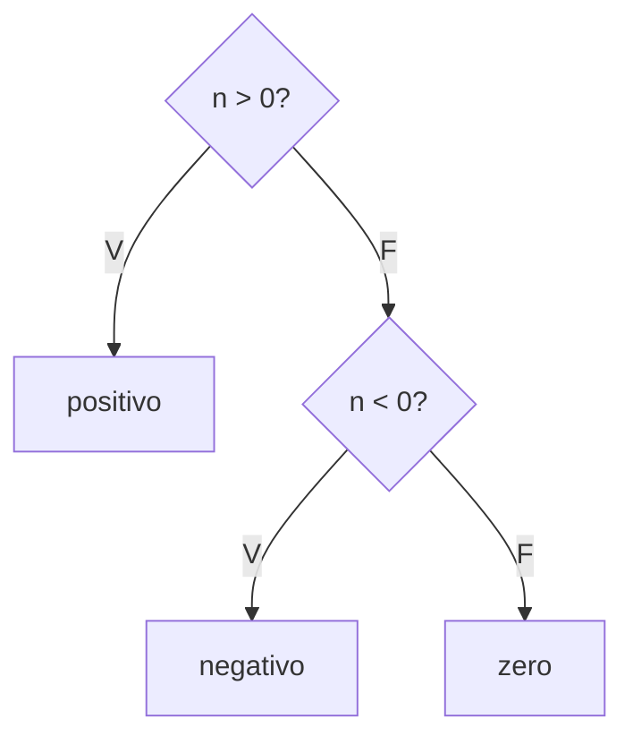

# Aula 05 — Teste de Caixa Branca (Estrutural)

!!! info "Objetivos da aula"
    - Entender o que é **teste de caixa branca** (estrutural).
    - Conhecer os **critérios de cobertura**: comando, decisão, condição, caminho.
    - Calcular a **complexidade ciclomática** de McCabe.
    - Derivar casos de teste a partir do **grafo de fluxo de controle**.

## Olhando dentro da caixa

No teste de **caixa branca** (também dito *estrutural*, *caixa de vidro* ou
*caixa transparente*), conhecemos e usamos a **estrutura interna** do código para
projetar os testes. A pergunta é: *"todos os caminhos importantes do código foram
exercitados?"*

=== "Caixa Branca (esta aula)"
    Baseia-se no **código**. Objetivo: **cobrir** comandos, decisões e caminhos.
    Quem faz costuma ser quem programa.

=== "Caixa Preta (próxima aula)"
    Baseia-se na **especificação**, ignorando o código. Objetivo: cobrir
    **entradas e saídas** esperadas.

## Critérios de cobertura

Do mais fraco ao mais forte:

| Critério | Exige que... | Força |
| :--- | :--- | :--- |
| **Comando** *(statement)* | toda linha execute ao menos 1 vez | fraca |
| **Decisão** *(branch)* | todo `if/while` seja testado **verdadeiro e falso** | média |
| **Condição** | cada subcondição booleana assuma V e F | forte |
| **Caminho** *(path)* | todo caminho independente seja percorrido | mais forte |

!!! warning "100% de comando não basta"
    Cobrir todas as **linhas** não garante cobrir todas as **decisões**. Um `if`
    sem `else` pode ter a linha de dentro executada e, ainda assim, o ramo "falso"
    nunca ser testado.

## Grafo de fluxo de controle

Transformamos o código em um grafo: **nós** são comandos e **arestas** são
desvios de fluxo.

```java
public String classificar(int n) {          // 1
    if (n > 0) {                             // 2
        return "positivo";                   // 3
    } else if (n < 0) {                      // 4
        return "negativo";                   // 5
    }
    return "zero";                           // 6
}
```



## Complexidade ciclomática (McCabe)

Mede o número de **caminhos independentes** — e, na prática, um bom **número
mínimo de casos de teste** para cobrir as decisões. Três formas de calcular:

$$
V(G) = E - N + 2 \qquad\text{ou}\qquad V(G) = P + 1
$$

Onde $E$ = arestas, $N$ = nós e $P$ = número de **pontos de decisão** (predicados).

!!! example "Calculando para o exemplo"
    O método `classificar` tem **2 decisões** (`n > 0` e `n < 0`), logo:

    $$V(G) = P + 1 = 2 + 1 = 3$$

    Precisamos de **3 casos** para cobrir as decisões: um positivo, um negativo e
    o zero.

## Derivando os casos de teste

```java
@Test void positivo() { assertEquals("positivo", classificar(7)); }
@Test void negativo() { assertEquals("negativo", classificar(-3)); }
@Test void zero()     { assertEquals("zero", classificar(0)); }
```

!!! tip "Cobertura como métrica, não como meta"
    Ferramentas como **JaCoCo** medem cobertura no Java. Alta cobertura é bom
    sinal, mas 100% de cobertura com asserts fracos ainda deixa passar defeitos.
    Cobertura mostra o que **não** foi testado, não que o teste é **bom**.

## Exercícios

??? abstract "Exercício 1 — Complexidade ciclomática"
    Calcule $V(G)$ para o método abaixo e diga o número mínimo de casos de teste:

    ```java
    boolean podeDirigir(int idade, boolean temHabilitacao) {
        if (idade >= 18 && temHabilitacao) {
            return true;
        }
        return false;
    }
    ```

??? abstract "Exercício 2 — Comando x decisão"
    Escreva um trecho de código com um `if` sem `else` em que **100% de cobertura
    de comando** seja atingida, mas a cobertura de **decisão** seja apenas 50%.

??? abstract "Exercício 3 — Do grafo aos testes"
    Desenhe o grafo de fluxo e liste os casos de teste necessários para cobrir
    **todas as decisões** de uma função que valida uma senha (mínimo 8 caracteres
    **e** ao menos um número).

!!! tip "Próxima Parada 🚀"
    Exercite a estrutura na [**Lista 05 — Caixa Branca**](../listas/05-lista.md).
    Na próxima aula fechamos a caixa e olhamos só entradas e saídas: **caixa preta**.
