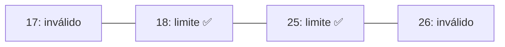
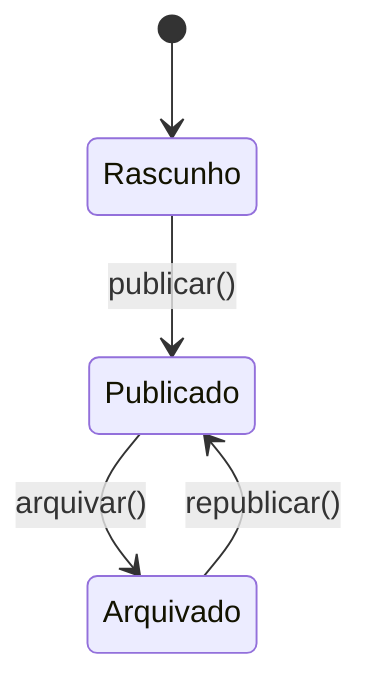

# Aula 06 — Teste de Caixa Preta (Funcional)

!!! info "Objetivos da aula"
    - Entender o **teste de caixa preta** (funcional) e quando usá-lo.
    - Aplicar **particionamento de equivalência**.
    - Aplicar **análise de valor-limite**.
    - Conhecer **tabela de decisão** e **transição de estados**.

## Fechando a caixa

No teste de **caixa preta**, ignoramos o código. Olhamos apenas o que **entra** e
o que **deve sair**, segundo a **especificação**. É como testar um forno: você não
abre para ver a resistência, você põe o bolo e vê se assa.

!!! success "Vantagem"
    Independe da implementação. Os testes continuam válidos mesmo que o código
    seja reescrito por dentro — desde que o comportamento externo seja o mesmo.

## Particionamento de equivalência

A ideia: dividir as entradas em **classes** que o software deve tratar do mesmo
jeito. Se um valor da classe funciona, presumimos que todos funcionam — então
basta **um representante** por classe.

!!! example "Idade para uma bolsa (18 a 25 anos)"
    | Classe | Faixa | Válida? | Representante |
    | :--- | :--- | :--- | :--- |
    | Abaixo | idade < 18 | ❌ inválida | 15 |
    | Dentro | 18 ≤ idade ≤ 25 | ✅ válida | 21 |
    | Acima | idade > 25 | ❌ inválida | 30 |

    Em vez de testar 15, 16, 17, 18, 19... testamos **um** de cada classe.

## Análise de valor-limite

Defeitos adoram **fronteiras** (`>` vs `>=`). Por isso testamos os **limites** de
cada partição válida — e seus vizinhos imediatos.



!!! example "Limites para a faixa 18–25"
    Casos essenciais: **17, 18, 25, 26** (as bordas e seus vizinhos).

    ```java
    @Test void limiteInferiorValido()   { assertTrue(elegivel(18)); }
    @Test void abaixoDoLimite()          { assertFalse(elegivel(17)); }
    @Test void limiteSuperiorValido()    { assertTrue(elegivel(25)); }
    @Test void acimaDoLimite()           { assertFalse(elegivel(26)); }
    ```

## Tabela de decisão

Útil quando a saída depende de **combinações** de condições.

!!! example "Desconto: cliente VIP e compra acima de R$ 100"
    | Regra | VIP? | Compra > 100? | Desconto |
    | :--- | :--- | :--- | :--- |
    | R1 | Não | Não | 0% |
    | R2 | Não | Sim | 5% |
    | R3 | Sim | Não | 10% |
    | R4 | Sim | Sim | 15% |

    Cada **regra** vira (ao menos) um caso de teste.

## Transição de estados

Quando o sistema tem **estados** e o comportamento depende da história (não só da
entrada atual), modelamos as transições.



Testamos **transições válidas** (Rascunho → Publicado) e também **inválidas**
(tentar arquivar um rascunho deve ser rejeitado).

## Caixa branca × caixa preta: complementares

=== "Use caixa branca quando..."
    Quer garantir que os **caminhos internos** e casos raros do código foram
    exercitados (Aula 05).

=== "Use caixa preta quando..."
    Quer validar **requisitos** e comportamento visível, sem depender da
    implementação.

!!! tip "Na prática, use as duas"
    Times maduros combinam: caixa preta guiada pela especificação **e** medição de
    cobertura (caixa branca) para achar buracos.

## Exercícios

??? abstract "Exercício 1 — Partições e limites"
    Um campo aceita **CEP com 8 dígitos**. Defina as classes de equivalência
    (válidas e inválidas) e os valores-limite que você testaria.

??? abstract "Exercício 2 — Tabela de decisão"
    Monte a tabela de decisão para: *um empréstimo é aprovado se o cliente tem
    renda acima de R$ 3.000 **e** score acima de 700*. Liste os casos de teste.

??? abstract "Exercício 3 — Transição de estados"
    Modele os estados de um pedido de e-commerce (ex.: Novo → Pago → Enviado →
    Entregue) e aponte **uma** transição inválida que deveria ser bloqueada.

!!! tip "Próxima Parada 🚀"
    Pratique na [**Lista 06 — Caixa Preta**](../listas/06-lista.md).
    Na próxima aula automatizamos tudo isso com **TDD e testes automatizados**.
