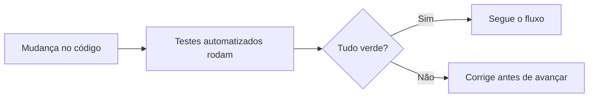
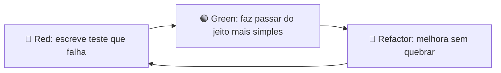

# Aula 07 — TDD e Testes Automatizados

!!! info "Objetivos da aula"
    - Entender o ciclo **Red-Green-Refactor** do TDD.
    - Escrever testes automatizados com **JUnit 5**.
    - Conhecer **asserts**, dublês de teste (**mocks**) e boas práticas (AAA).
    - Ligar os testes ao **pipeline de CI** (Aula 02).

## Por que automatizar?

Teste manual não escala: repetir 200 verificações a cada mudança é inviável.
Testes **automatizados** rodam em segundos, sempre do mesmo jeito, e podem ser
disparados pelo CI a cada `push`.



## TDD: teste primeiro

**Test-Driven Development** inverte a ordem: você escreve o **teste antes** do
código de produção. O ciclo é curto e repetido:



=== "🔴 Red"
    Escreva um teste para um comportamento que **ainda não existe**. Ele **deve
    falhar** — se passar, o teste está errado.

=== "🟢 Green"
    Escreva o **mínimo** de código para o teste passar. Sem elegância ainda; só
    fazer ficar verde.

=== "🔵 Refactor"
    Com a rede de segurança dos testes, **melhore** o código (nomes, duplicação)
    sabendo que, se quebrar, o teste avisa.

!!! quote "O valor do TDD"
    O teste vira **especificação executável**: descreve o que o código deve fazer
    *antes* de ele existir, e continua verificando para sempre.

### Um ciclo completo, passo a passo

Vamos aplicar Red-Green-Refactor a uma função `ehPar(int)`:

=== "🔴 Red"
    Escrevo o teste **antes** de existir a função. Ele não compila / falha — e está
    certo que falhe.
    ```java
    @Test void deveReconhecerNumeroPar()   { assertTrue(ehPar(4)); }
    @Test void deveReconhecerNumeroImpar() { assertFalse(ehPar(3)); }
    ```

=== "🟢 Green"
    Escrevo o **mínimo** para passar — sem pensar em elegância.
    ```java
    boolean ehPar(int n) { return n % 2 == 0; }
    ```
    Rodo os testes: verde.

=== "🔵 Refactor"
    Com a rede de segurança, melhoro **sem mudar o comportamento**: um nome melhor,
    tratar o caso de negativos, extrair constante… e rodo os testes de novo para
    confirmar que continua verde. Só então adiciono o **próximo** teste (ex.:
    `ehPar(0)` deve ser `true`) e recomeço o ciclo.

!!! warning "A ordem não é opcional"
    Se você escreve o código **primeiro** e o teste **depois**, não é TDD — e você
    perde a principal garantia: ver o teste **falhar** prova que ele realmente
    testa algo. Um teste que nunca falhou pode estar verde por engano.

## Anatomia de um teste (padrão AAA)

Organize cada teste em três blocos: **Arrange, Act, Assert**.

```java
import static org.junit.jupiter.api.Assertions.*;
import org.junit.jupiter.api.Test;

class CarrinhoTest {

    @Test
    void deveSomarOsPrecosDosItens() {
        // Arrange (preparar)
        var carrinho = new Carrinho();
        carrinho.adicionar(new Item("Café", 10.0));
        carrinho.adicionar(new Item("Pão", 5.0));

        // Act (agir)
        double total = carrinho.total();

        // Assert (verificar)
        assertEquals(15.0, total, 0.001);
    }
}
```

| Assert (JUnit 5) | Verifica |
| :--- | :--- |
| `assertEquals(esp, real)` | valores iguais |
| `assertTrue / assertFalse` | condição booleana |
| `assertThrows(Ex.class, ...)` | que uma exceção é lançada |
| `assertNull / assertNotNull` | nulidade |

!!! example "Testando que uma exceção é lançada"
    Regras de negócio muitas vezes se expressam como "**deve rejeitar**" algo. O
    `assertThrows` verifica que a operação lança a exceção certa:
    ```java
    @Test
    void naoDevePermitirSaqueMaiorQueSaldo() {
        // Arrange
        var conta = new Conta(100.0);

        // Act + Assert
        assertThrows(SaldoInsuficienteException.class,
            () -> conta.sacar(150.0));
    }
    ```
    Repare: o *Act* (a chamada que deve falhar) vai **dentro** do lambda passado ao
    `assertThrows`. Se a exceção **não** for lançada, o teste falha.

## Dublês de teste: mocks

Às vezes a classe depende de algo lento ou externo (banco, API). Usamos um
**dublê** para isolar a unidade sob teste. Com **Mockito**:

```java
import static org.mockito.Mockito.*;

@Test
void deveNegarPedidoSemEstoque() {
    Estoque estoque = mock(Estoque.class);
    when(estoque.disponivel("SKU-1")).thenReturn(false);

    var servico = new PedidoService(estoque);

    assertThrows(SemEstoqueException.class,
        () -> servico.finalizar("SKU-1"));
}
```

!!! warning "Não abuse de mocks"
    Mock demais testa a **interação**, não o **resultado**. Prefira objetos reais
    quando forem rápidos e simples; reserve mocks para dependências externas.

### A família dos dublês

"Mock" é só um dos tipos de dublê de teste (*test double*):

| Dublê | Para que serve |
| :--- | :--- |
| **Dummy** | objeto só para preencher um parâmetro; não é usado |
| **Stub** | devolve respostas prontas (`when(...).thenReturn(...)`) |
| **Spy** | objeto real, mas registra como foi chamado |
| **Fake** | implementação leve de verdade (ex.: repositório em memória) |
| **Mock** | verifica **interações** esperadas (`verify(...)`) |

!!! tip "Quando mockar (e quando não)"
    Decida pelo **F.I.R.S.T.**:

    - **Vale mockar:** dependências **lentas, externas ou não determinísticas** —
      banco de dados, API HTTP, envio de e-mail, relógio do sistema. Sem o dublê o
      teste não seria *Fast* nem *Repeatable*.
    - **Não vale mockar:** objetos **rápidos e puros** — uma classe de cálculo, um
      *value object*, uma lista. Mockar aqui só adiciona ruído e testa a
      implementação em vez do resultado.

## Boa nomenclatura e independência

!!! tip "Características de um bom teste (F.I.R.S.T.)"
    - **Fast** — roda rápido.
    - **Independent** — não depende da ordem nem de outro teste.
    - **Repeatable** — mesmo resultado sempre.
    - **Self-validating** — passa ou falha, sem conferência manual.
    - **Timely** — escrito junto (ou antes) do código.

## Exercícios

??? abstract "Exercício 1 — Ciclo TDD"
    Descreva, passo a passo, como você usaria Red-Green-Refactor para implementar
    uma função `ehPar(int)`. Escreva o teste **antes** do código.

??? abstract "Exercício 2 — AAA na prática"
    Escreva um teste JUnit no padrão AAA para uma classe `Conta` que não permite
    saque maior que o saldo (deve lançar `SaldoInsuficienteException`).

??? abstract "Exercício 3 — Quando usar mock?"
    Dê um exemplo de dependência que **vale** mockar e um exemplo que **não** vale.
    Justifique com base no F.I.R.S.T.

## Referências

**Leitura base**

- BECK, Kent. *TDD: Desenvolvimento Guiado por Testes* (*Test-Driven Development by
  Example*). Bookman/Addison-Wesley, 2003 — obra que popularizou o TDD.
- FREEMAN, S.; PRYCE, N. *Growing Object-Oriented Software, Guided by Tests*.
  Addison-Wesley, 2009.

**Documentação oficial**

- JUnit 5 — *User Guide*: <https://junit.org/junit5/docs/current/user-guide/>.
- Mockito: <https://site.mockito.org/>.

**Para aprofundar**

- FOWLER, Martin. *Mocks Aren't Stubs*:
  <https://martinfowler.com/articles/mocksArentStubs.html>.

!!! tip "Próxima Parada 🚀"
    Escreva seus primeiros testes na [**Lista 07 — TDD e Automação**](../listas/07-lista.md).
    Na próxima aula subimos a escada dos **níveis de teste**.
