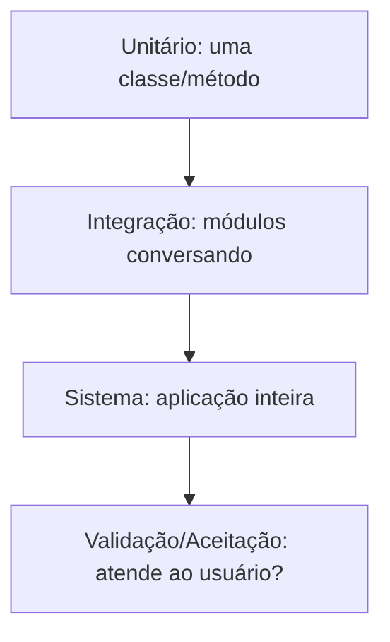
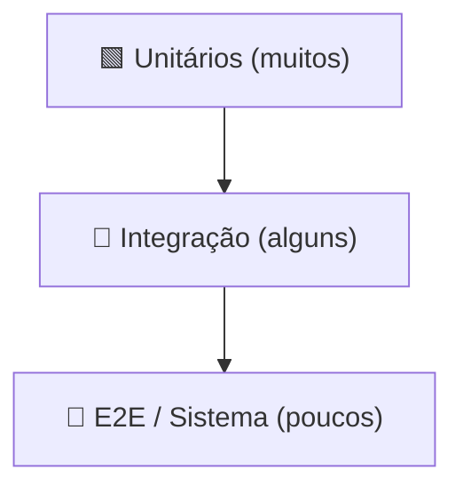

# Aula 08 — Níveis de Teste: do Unitário ao Sistema

!!! info "Objetivos da aula"
    - Distinguir os **níveis** de teste: unitário, integração, sistema e validação/aceitação.
    - Entender as **estratégias de integração** (big-bang, top-down, bottom-up).
    - Conhecer a **pirâmide de testes** e por que ela importa.
    - Saber **onde** cada nível roda e **quem** o executa.

## A escada dos níveis

Cada nível olha o software em uma "altura" diferente, dos tijolos ao prédio pronto.



| Nível | Escopo | Referência | Quem faz |
| :--- | :--- | :--- | :--- |
| **Unitário** | menor unidade (método/classe) | projeto detalhado | dev |
| **Integração** | interação entre módulos | projeto de arquitetura | dev / QA |
| **Sistema** | sistema completo em ambiente realista | requisitos | QA / testadores |
| **Validação/Aceitação** | atende à necessidade real | requisitos do usuário | cliente / usuário |

## Teste unitário

Testa a **menor parte** isolada — normalmente um método ou classe. Rápido, barato,
roda a cada `push`. É onde o TDD (Aula 07) atua.

```java
@Test
void deveCalcularJuroSimples() {
    var calc = new Calculadora();
    assertEquals(110.0, calc.montante(100, 0.10, 1), 0.001);
}
```

## Teste de integração

Verifica se os módulos **conversam** corretamente: contratos, formatos, chamadas
a banco/serviços. Achamos aqui os bugs que "cada um funciona sozinho, mas juntos
quebram".

=== "Big-bang"
    Integra **tudo de uma vez** e testa. Simples de montar, mas difícil de
    localizar a origem da falha.

=== "Top-down"
    Começa pelos módulos de **cima** (que chamam outros), usando **stubs** para os
    de baixo ainda não prontos.

=== "Bottom-up"
    Começa pelos módulos de **baixo** (base), usando **drivers** para simular quem
    os chamaria.

!!! note "Stub × Driver"
    - **Stub**: substitui um módulo **chamado** (de baixo). Usado no top-down.
    - **Driver**: simula um módulo **chamador** (de cima). Usado no bottom-up.

## Teste de sistema

O sistema **completo** é testado em um ambiente próximo do real, contra os
requisitos. Inclui testes **não-funcionais**:

- ⚡ **Desempenho** e carga
- 🔒 **Segurança**
- 🧭 **Usabilidade**
- 🔁 **Confiabilidade** / recuperação

## Teste de validação / aceitação

Responde à pergunta de **validação** (Aula 04): *"é o produto certo?"*. É o
usuário/cliente confirmando que o sistema atende à necessidade.

- **Alfa**: no ambiente do desenvolvedor, com usuários selecionados.
- **Beta**: no ambiente do usuário, uso real antes do lançamento.

## A pirâmide de testes

Quanto mais **baixo** o nível, mais testes você deve ter (rápidos e baratos).
Quanto mais **alto**, menos (lentos e caros).



!!! warning "Cuidado com o 'cone de sorvete'"
    A pirâmide **invertida** (muitos testes de UI, poucos unitários) é lenta,
    frágil e cara. É um antipadrão comum — evite.

## Exercícios

??? abstract "Exercício 1 — Classifique o nível"
    Diga o nível de teste de cada caso:

    1. Verificar se o método `formatarCpf` devolve `123.456.789-00`.
    2. Conferir se o cadastro salva de fato no banco de dados.
    3. Cliente navegar no sistema inteiro e aprovar antes do lançamento.

??? abstract "Exercício 2 — Stub ou driver?"
    Você vai integrar de baixo para cima (bottom-up). Precisará de **stubs** ou
    **drivers**? Explique o papel do componente que você criará.

??? abstract "Exercício 3 — Pirâmide"
    Um time tem 5 testes unitários e 60 testes de interface (E2E). Que problema
    isso indica? Como você reequilibraria a pirâmide?

!!! tip "Próxima Parada 🚀"
    Aplique os níveis na [**Lista 08 — Níveis de Teste**](../listas/08-lista.md).
    Na próxima aula documentamos tudo em um **plano e roteiro de testes**.
