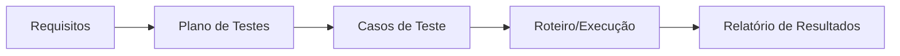

# Aula 09 — Plano e Roteiro de Testes

!!! info "Objetivos da aula"
    - Entender o que é e para que serve um **plano de testes**.
    - Conhecer a estrutura de um plano (inspirada na **IEEE 829**).
    - Escrever **casos** e **roteiros** de teste claros e reproduzíveis.
    - Definir **critérios de entrada e saída** e rastreabilidade.

## Por que planejar?

Testar sem plano é caçar defeitos no escuro: você não sabe o que já cobriu, o que
falta, nem quando parar. O **plano de testes** organiza *o que, como, quem, quando
e com quais critérios* vamos testar.



## Estrutura de um plano (IEEE 829)

??? note "Seções típicas de um plano de testes"
    - **Objetivo e escopo** — o que será (e o que **não** será) testado.
    - **Itens a testar** — módulos, funcionalidades, versões.
    - **Estratégia/abordagem** — níveis e técnicas (caixa branca/preta).
    - **Critérios de entrada** — condições para **começar** a testar.
    - **Critérios de saída** — condições para **parar** (definição de "pronto").
    - **Ambiente** — hardware, dados, ferramentas.
    - **Cronograma e responsáveis** — quem faz o quê e quando.
    - **Riscos** — o que pode dar errado e plano B.

!!! example "Critérios de entrada e saída"
    === "Entrada"
        - Build implantado no ambiente de teste.
        - Massa de dados de teste disponível.
        - Casos de teste revisados.
    === "Saída"
        - 100% dos casos críticos executados.
        - Nenhum defeito **bloqueante** em aberto.
        - Cobertura mínima acordada atingida.

### O que faz um bom critério de saída

Um critério de saída define **quando parar de testar** — e precisa ser
**objetivo e verificável**, não uma opinião. Compare:

- ❌ *"Quando o tempo acabar."* Não mede qualidade nenhuma — só mede o relógio. Um
  prazo pode estourar com o sistema cheio de defeitos críticos, ou sobrar tempo com
  tudo já validado. O calendário não sabe se o software está pronto.
- ❌ *"Quando estiver bom o suficiente."* Subjetivo; cada pessoa decide diferente.
- ✅ *"100% dos casos de teste **críticos** executados e aprovados."*
- ✅ *"Zero defeitos de severidade **alta ou bloqueante** em aberto."*
- ✅ *"Cobertura de código ≥ 80% nos módulos de pagamento."*
- ✅ *"Defeitos abertos < 5, todos de severidade baixa e com contorno conhecido."*

!!! tip "Regra"
    Um bom critério pode ser respondido com **sim ou não** por qualquer pessoa
    olhando os dados — sem depender de quem está julgando.

## Caso de teste × Roteiro de teste

=== "Caso de teste"
    Descreve **um** cenário: pré-condição, entrada, passos, **resultado esperado**.
    É a unidade básica.

=== "Roteiro (test script/suite)"
    **Sequência** de casos a executar em uma sessão, muitas vezes contando uma
    história (ex.: "cadastrar → logar → comprar → sair").

### Anatomia de um caso de teste

| Campo | Exemplo |
| :--- | :--- |
| **ID** | CT-012 |
| **Título** | Login com senha incorreta |
| **Pré-condição** | Usuário `ana` existe e está ativo |
| **Passos** | 1. Abrir login; 2. Informar `ana`/senha errada; 3. Confirmar |
| **Dados** | senha = `"1234errada"` |
| **Resultado esperado** | Mensagem "Credenciais inválidas"; acesso negado |
| **Resultado obtido** | *(preenchido na execução)* |
| **Status** | Passou / Falhou / Bloqueado |

!!! tip "Um bom resultado esperado é específico"
    "Deve dar erro" é fraco. "Deve exibir a mensagem *Credenciais inválidas* e
    **não** redirecionar" é verificável.

!!! note "Boas práticas ao escrever um caso de teste"
    - **Um objetivo por caso.** Se o título tem "e", provavelmente são dois casos.
    - **Passos reproduzíveis.** Qualquer pessoa deve chegar ao mesmo resultado.
    - **Dados explícitos.** Diga o valor exato (`senha = "1234errada"`), não
      "uma senha qualquer".
    - **Pré-condição clara.** O estado necessário antes de começar (usuário existe,
      está logado…).
    - **Resultado esperado observável e único.** Descreva o que se **vê**, não o que
      se "sente".

## Rastreabilidade: ligando requisito ao teste

A **matriz de rastreabilidade** garante que **todo requisito** tem ao menos um
caso de teste — e que nenhum teste testa algo que ninguém pediu.

| Requisito | Casos de teste |
| :--- | :--- |
| RF-01 Login | CT-010, CT-011, CT-012 |
| RF-02 Recuperar senha | CT-020 |
| RF-03 Cadastro | CT-030, CT-031 |

A matriz é lida em **duas direções**, e cada uma revela um problema diferente:

- **Requisito → casos:** um requisito **sem** nenhum caso é uma **lacuna de teste**
  (estamos entregando algo que ninguém verifica).
- **Caso → requisito:** um caso que **não aponta** para nenhum requisito é um teste
  **órfão** (testamos algo que ninguém pediu — pode ser esforço desperdiçado ou um
  requisito não documentado).

!!! example "Montando uma matriz pequena"
    Para RF-01 (login), RF-02 (logout) e RF-03 (trocar senha), o mínimo é ao menos
    **um caso por requisito** — de preferência um caminho feliz e um de erro:

    | Requisito | Casos de teste |
    | :--- | :--- |
    | RF-01 Login | CT-01 (sucesso), CT-02 (senha errada) |
    | RF-02 Logout | CT-03 (encerra sessão) |
    | RF-03 Trocar senha | CT-04 (troca válida), CT-05 (senha atual errada) |

## Do caso de teste ao código

Um caso de teste bem escrito vira teste automatizado quase que diretamente:

```java
@Test
void loginComSenhaIncorretaDeveSerNegado() {
    var auth = new AuthService(repositorioComUsuarioAna());

    var resultado = auth.autenticar("ana", "1234errada");

    assertFalse(resultado.autorizado());
    assertEquals("Credenciais inválidas", resultado.mensagem());
}
```

## Exercícios

??? abstract "Exercício 1 — Escreva um caso de teste"
    Escolha uma funcionalidade simples (ex.: cadastro com e-mail obrigatório) e
    escreva um caso de teste completo, com todos os campos da tabela acima.

??? abstract "Exercício 2 — Critérios de saída"
    Defina **três** critérios de saída objetivos para o teste de um app de
    pagamentos. Por que "quando o tempo acabar" é um mau critério?

??? abstract "Exercício 3 — Rastreabilidade"
    Dados os requisitos RF-01 (login), RF-02 (logout) e RF-03 (trocar senha),
    monte uma pequena matriz de rastreabilidade com pelo menos um caso por
    requisito.

## Referências

**Leitura base**

- PRESSMAN, R. S.; MAXIM, B. R. *Engenharia de Software*. 8. ed. AMGH, 2016 —
  cap. sobre planejamento de testes.
- SOMMERVILLE, Ian. *Engenharia de Software*. 10. ed. Pearson, 2019 — cap. 8.

**Normas**

- IEEE 829 — *Standard for Software Test Documentation* (estrutura do plano e do
  caso de teste).
- ISO/IEC/IEEE 29119 — série sobre processos e documentação de teste (sucessora
  moderna da IEEE 829).

**Ferramentas de gestão de testes**

- TestLink, Xray (Jira), Azure Test Plans — organizam casos, execuções e
  rastreabilidade.

!!! tip "Próxima Parada 🚀"
    Documente seus testes na [**Lista 09 — Plano de Testes**](../listas/09-lista.md).
    Na próxima aula começamos a **medir**: métricas, indicadores e pontos de função.
