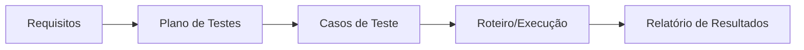

# Aula 09 — Plano e Roteiro de Testes

!!! info "Objetivos da aula"
    - Entender o que é e para que serve um **plano de testes**.
    - Conhecer a estrutura de um plano (inspirada na **IEEE 829**).
    - Escrever **casos** e **roteiros** de teste claros e reproduzíveis.
    - Definir **critérios de entrada e saída** e rastreabilidade.

## Por que planejar?

Testar sem plano é caçar defeitos no escuro: você não sabe o que já cobriu, o que
falta, nem quando parar. O **plano de testes** organiza *o que, como, quem, quando
e com quais critérios* vamos testar.



## Estrutura de um plano (IEEE 829)

??? note "Seções típicas de um plano de testes"
    - **Objetivo e escopo** — o que será (e o que **não** será) testado.
    - **Itens a testar** — módulos, funcionalidades, versões.
    - **Estratégia/abordagem** — níveis e técnicas (caixa branca/preta).
    - **Critérios de entrada** — condições para **começar** a testar.
    - **Critérios de saída** — condições para **parar** (definição de "pronto").
    - **Ambiente** — hardware, dados, ferramentas.
    - **Cronograma e responsáveis** — quem faz o quê e quando.
    - **Riscos** — o que pode dar errado e plano B.

!!! example "Critérios de entrada e saída"
    === "Entrada"
        - Build implantado no ambiente de teste.
        - Massa de dados de teste disponível.
        - Casos de teste revisados.
    === "Saída"
        - 100% dos casos críticos executados.
        - Nenhum defeito **bloqueante** em aberto.
        - Cobertura mínima acordada atingida.

## Caso de teste × Roteiro de teste

=== "Caso de teste"
    Descreve **um** cenário: pré-condição, entrada, passos, **resultado esperado**.
    É a unidade básica.

=== "Roteiro (test script/suite)"
    **Sequência** de casos a executar em uma sessão, muitas vezes contando uma
    história (ex.: "cadastrar → logar → comprar → sair").

### Anatomia de um caso de teste

| Campo | Exemplo |
| :--- | :--- |
| **ID** | CT-012 |
| **Título** | Login com senha incorreta |
| **Pré-condição** | Usuário `ana` existe e está ativo |
| **Passos** | 1. Abrir login; 2. Informar `ana`/senha errada; 3. Confirmar |
| **Dados** | senha = `"1234errada"` |
| **Resultado esperado** | Mensagem "Credenciais inválidas"; acesso negado |
| **Resultado obtido** | *(preenchido na execução)* |
| **Status** | Passou / Falhou / Bloqueado |

!!! tip "Um bom resultado esperado é específico"
    "Deve dar erro" é fraco. "Deve exibir a mensagem *Credenciais inválidas* e
    **não** redirecionar" é verificável.

## Rastreabilidade: ligando requisito ao teste

A **matriz de rastreabilidade** garante que **todo requisito** tem ao menos um
caso de teste — e que nenhum teste testa algo que ninguém pediu.

| Requisito | Casos de teste |
| :--- | :--- |
| RF-01 Login | CT-010, CT-011, CT-012 |
| RF-02 Recuperar senha | CT-020 |
| RF-03 Cadastro | CT-030, CT-031 |

## Do caso de teste ao código

Um caso de teste bem escrito vira teste automatizado quase que diretamente:

```java
@Test
void loginComSenhaIncorretaDeveSerNegado() {
    var auth = new AuthService(repositorioComUsuarioAna());

    var resultado = auth.autenticar("ana", "1234errada");

    assertFalse(resultado.autorizado());
    assertEquals("Credenciais inválidas", resultado.mensagem());
}
```

## Exercícios

??? abstract "Exercício 1 — Escreva um caso de teste"
    Escolha uma funcionalidade simples (ex.: cadastro com e-mail obrigatório) e
    escreva um caso de teste completo, com todos os campos da tabela acima.

??? abstract "Exercício 2 — Critérios de saída"
    Defina **três** critérios de saída objetivos para o teste de um app de
    pagamentos. Por que "quando o tempo acabar" é um mau critério?

??? abstract "Exercício 3 — Rastreabilidade"
    Dados os requisitos RF-01 (login), RF-02 (logout) e RF-03 (trocar senha),
    monte uma pequena matriz de rastreabilidade com pelo menos um caso por
    requisito.

!!! tip "Próxima Parada 🚀"
    Documente seus testes na [**Lista 09 — Plano de Testes**](../listas/09-lista.md).
    Na próxima aula começamos a **medir**: métricas, indicadores e pontos de função.
