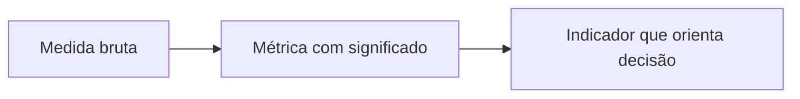

# Aula 10 — Métricas, Indicadores e Pontos de Função

!!! info "Objetivos da aula"
    - Distinguir **medida, métrica e indicador**.
    - Diferenciar métricas de **produto**, **processo** e **projeto**.
    - Entender **Análise de Pontos de Função (APF)** e por que independe da linguagem.
    - Conhecer técnicas de **estimativa** de projeto.

## Medir para gerenciar

> "Você não pode controlar o que não consegue medir." — DeMarco

Medir dá **objetividade**: substitui "acho que está melhorando" por evidência.
Mas medir errado leva a decisões erradas — por isso é preciso entender os termos.

=== "Medida"
    Um **valor bruto** de um atributo. Ex.: "o módulo tem 1.200 linhas".

=== "Métrica"
    **Relação** entre medidas, com significado. Ex.: "0,8 defeito por KLOC".

=== "Indicador"
    Uma métrica (ou conjunto) usada para **apoiar uma decisão**. Ex.: "a densidade
    de defeitos subiu 3 meses seguidos → revisar o processo".

!!! tip "Como distinguir na prática"
    - **Medida:** um número cru, sem comparação. *"45.000 linhas de código."*
    - **Métrica:** uma **razão** ou relação com significado. *"1,2 defeito por ponto
      de função."*
    - **Indicador:** a métrica **interpretada** para **decidir** algo, normalmente
      olhando **tendência** ou **meta**. *"A densidade de defeitos cai há 4 sprints,
      podemos reduzir o retrabalho."*

    Pergunta-chave: *isso sozinho me faz **agir**?* Se sim, é indicador. Se é só uma
    relação, é métrica. Se é um valor solto, é medida.

## Produto, processo e projeto

| Categoria | Mede... | Exemplos |
| :--- | :--- | :--- |
| **Produto** | qualidade/característica do software | densidade de defeitos, complexidade ciclomática, cobertura |
| **Processo** | eficiência do jeito de trabalhar | eficácia de remoção de defeitos, tempo de ciclo |
| **Projeto** | andamento do projeto | esforço (horas), prazo, custo, produtividade |

!!! tip "Pergunta que separa as três"
    - Fala do **software em si** (algo que você mede lendo/executando o código)? →
      **Produto**. Ex.: cobertura de testes, complexidade.
    - Fala de **como trabalhamos** (a eficiência do jeito de produzir)? →
      **Processo**. Ex.: % de defeitos removidos em revisão, *lead time*.
    - Fala do **andamento deste projeto** (recursos, prazo)? → **Projeto**. Ex.:
      horas gastas no sprint, custo, atraso.

!!! example "Densidade de defeitos"
    $$
    \text{Densidade} = \frac{\text{nº de defeitos}}{\text{tamanho (KLOC ou PF)}}
    $$
    Comparar densidade **por módulo** ajuda a achar onde os defeitos se agrupam
    (princípio 4 da Aula 04).

## O problema de medir por linhas de código

Contar **LOC** (linhas de código) parece prático, mas é enganoso: depende da
linguagem, do estilo e pune quem escreve código enxuto. Uma mesma funcionalidade
pode ter 10 linhas em uma linguagem e 100 em outra.

!!! warning "LOC como meta é perigoso"
    Se você **paga por linha**, ganha código inflado. Métrica vira alvo, alvo
    corrompe a métrica (Lei de Goodhart).

## Análise de Pontos de Função (APF)

Mede o **tamanho funcional** pela ótica do **usuário** — o que o sistema *faz* —
independentemente de linguagem ou tecnologia. Cinco tipos de função:

| Componente | O que é |
| :--- | :--- |
| **EE** — Entrada Externa | dados entrando (ex.: formulário de cadastro) |
| **SE** — Saída Externa | dados saindo processados (ex.: relatório) |
| **CE** — Consulta Externa | consulta que só recupera dados |
| **ALI** — Arquivo Lógico Interno | dados mantidos **dentro** do sistema |
| **AIE** — Arquivo de Interface Externa | dados referenciados de **outro** sistema |

O cálculo (simplificado) soma os componentes ponderados por complexidade
(baixa/média/alta), gerando os **Pontos de Função Não Ajustados**, depois
ajustados por fatores gerais:

$$
PF = PFNA \times FA
$$

onde $FA$ é o **fator de ajuste** derivado das características gerais do sistema.

!!! tip "Por que PF é melhor que LOC para estimar"
    PF é medido a partir dos **requisitos**, ainda no início — antes de existir uma
    única linha de código. Serve para estimar **esforço e prazo** cedo.

## Estimativa de projeto

=== "Por analogia"
    Compara com projetos passados parecidos. Rápido, mas exige histórico.

=== "Por especialista (Delphi)"
    Vários especialistas estimam, discutem as diferenças e convergem.

=== "Paramétrica (ex.: COCOMO)"
    Usa fórmulas calibradas: a partir do tamanho (ex.: PF ou KLOC) estima esforço
    em pessoa-mês.

!!! example "Do tamanho ao esforço"
    Se um sistema tem **200 PF** e a produtividade histórica do time é **10 PF por
    pessoa-mês**, uma estimativa inicial de esforço é:
    $$
    \text{Esforço} = \frac{200 \text{ PF}}{10 \text{ PF/pessoa-mês}} = 20 \text{ pessoas-mês}
    $$

### Do esforço ao prazo (com a equipe)

**Esforço** (pessoas-mês) e **prazo** (meses) não são a mesma coisa. Para estimar o
prazo, divida o esforço pelo tamanho da equipe:
$$
\text{Prazo} \approx \frac{\text{Esforço (pessoas-mês)}}{\text{nº de pessoas}}
$$

!!! example "Esforço → prazo"
    Um projeto de **350 PF** com produtividade de **14 PF/pessoa-mês**:
    $$
    \text{Esforço} = \frac{350}{14} = 25 \text{ pessoas-mês}
    $$
    Com uma **equipe de 5 pessoas**:
    $$
    \text{Prazo} \approx \frac{25}{5} = 5 \text{ meses}
    $$

!!! warning "Cuidado: pessoas-mês não é linear (Lei de Brooks)"
    A divisão acima é uma **aproximação**. Dobrar a equipe **não** corta o prazo pela
    metade: mais gente traz mais comunicação, integração e treinamento. *"Acrescentar
    pessoas a um projeto atrasado o atrasa ainda mais"* (Fred Brooks). Use a conta
    como ponto de partida, não como promessa.

## Exercícios

??? abstract "Exercício 1 — Medida, métrica ou indicador?"
    Classifique:

    1. "O sistema tem 45.000 linhas de código."
    2. "1,2 defeito por ponto de função."
    3. "A densidade de defeitos vem caindo há 4 sprints, podemos reduzir o retrabalho."

??? abstract "Exercício 2 — Classifique a métrica"
    Diga se é de **produto**, **processo** ou **projeto**: cobertura de testes;
    horas gastas no sprint; percentual de defeitos removidos em revisão.

??? abstract "Exercício 3 — Estimativa por PF"
    Um projeto tem 350 PF e a produtividade do time é 14 PF/pessoa-mês. Estime o
    esforço. Se a equipe tem 5 pessoas, quantos meses (aproximadamente)?

## Referências

**Leitura base**

- PRESSMAN, R. S.; MAXIM, B. R. *Engenharia de Software*. 8. ed. AMGH, 2016 —
  cap. sobre métricas de processo e produto.
- FENTON, N.; BIEMAN, J. *Software Metrics: A Rigorous and Practical Approach*.
  3. ed. CRC Press, 2014.

**Pontos de função**

- IFPUG — *International Function Point Users Group*: <https://www.ifpug.org/>.
- ISO/IEC 20926 — método de contagem de pontos de função (IFPUG).

**Para aprofundar**

- BROOKS, F. P. *O Mítico Homem-Mês* (*The Mythical Man-Month*), 1975 — sobre
  esforço, prazo e a não linearidade de equipes.
- BOEHM, B. *Software Engineering Economics*, 1981 — modelo **COCOMO**.

!!! tip "Próxima Parada 🚀"
    Calcule na [**Lista 10 — Métricas e Pontos de Função**](../listas/10-lista.md).
    Na próxima aula: **modelos de qualidade** — ISO 9126, CMMI e MPS.BR.
