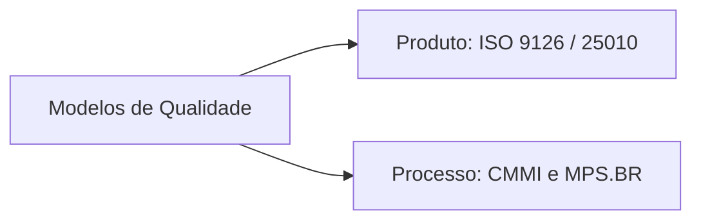
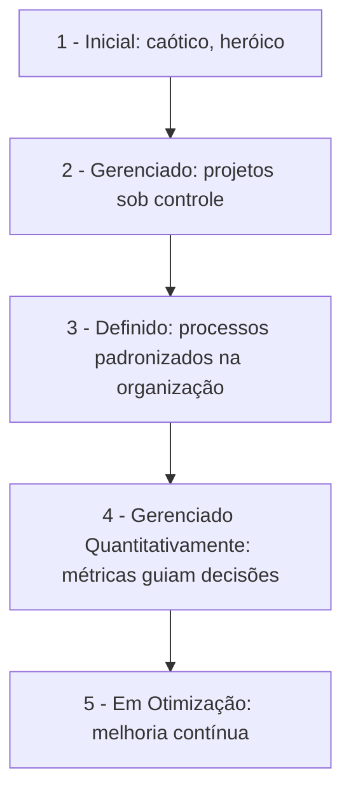

# Aula 11 — Modelos de Qualidade: ISO 9126, CMMI e MPS.BR

!!! info "Objetivos da aula"
    - Diferenciar **qualidade de produto** (ISO 9126) de **qualidade de processo** (CMMI, MPS.BR).
    - Conhecer as **características** de qualidade da ISO 9126 (e a evolução para a 25010).
    - Entender os **níveis de maturidade** do CMMI.
    - Situar o **MPS.BR** no contexto brasileiro.

## Dois focos, dois tipos de modelo

- **Produto**: *o software entregue tem qualidade?* → **ISO 9126**.
- **Processo**: *nosso jeito de produzir é maduro e melhora?* → **CMMI / MPS.BR**.

## ISO 9126 — qualidade de produto

Define **seis características** de qualidade, cada uma com subcaracterísticas:

| Característica | Pergunta que responde |
| :--- | :--- |
| **Funcionalidade** | Faz o que promete? (adequação, precisão, segurança) |
| **Confiabilidade** | Mantém o desempenho ao longo do tempo? (maturidade, tolerância a falhas) |
| **Usabilidade** | É fácil de aprender e operar? |
| **Eficiência** | Usa bem os recursos (tempo, memória)? |
| **Manutenibilidade** | É fácil de corrigir e evoluir? |
| **Portabilidade** | É fácil levar para outro ambiente? |

!!! note "Evolução: ISO/IEC 25010"
    A 9126 foi substituída pela família **SQuaRE (ISO/IEC 25010)**, que amplia para
    **oito** características, acrescentando **Segurança** e **Compatibilidade** como
    características próprias. Em prova, saiba que a 25010 é a sucessora.

## CMMI — maturidade de processo

**Capability Maturity Model Integration** organiza a maturidade do processo em
**cinco níveis** (representação por estágios). Cada nível é base para o próximo.

| Nível | Nome | Ideia central |
| :--- | :--- | :--- |
| 1 | Inicial | sucesso depende de heróis; imprevisível |
| 2 | Gerenciado | processos por **projeto**, planejados e controlados |
| 3 | Definido | processos **padronizados** na organização |
| 4 | Gerenciado Quantitativamente | uso de **métricas** e estatística |
| 5 | Em Otimização | **melhoria contínua** do processo |

!!! tip "Progressão, não salto"
    Não se pula do nível 1 para o 4. Cada nível institucionaliza práticas que
    sustentam o seguinte.

## MPS.BR — o modelo brasileiro

O **MPS.BR** (Melhoria de Processo do Software Brasileiro) nasceu para tornar a
melhoria de processo **acessível às pequenas e médias empresas** brasileiras,
compatível com CMMI e ISO 12207/15504. Sua escala tem **sete níveis** (de **G** a
**A**), com passos menores — mais fáceis de adotar aos poucos.

=== "CMMI"
    5 níveis, foco internacional, adoção mais custosa. Muito usado por grandes
    empresas e contratos internacionais.

=== "MPS.BR"
    7 níveis (G→A), passos graduais, custo menor. Pensado para a realidade das
    empresas brasileiras, com escala mais fina de evolução.

!!! example "De G a A"
    Os níveis do MPS.BR vão de **G (Parcialmente Gerenciado)**, o primeiro passo,
    subindo por F, E, D, C, B até **A (Em Otimização)**, o mais alto — análogo em
    espírito ao topo do CMMI.

## Por que isso importa para você

Modelos de processo explicam **por que** as práticas das aulas anteriores existem:
revisão (Aula 03), teste planejado (Aula 09) e métricas (Aula 10) são exatamente
o tipo de prática que os níveis mais altos **institucionalizam**.

## Exercícios

??? abstract "Exercício 1 — Produto ou processo?"
    Classifique cada modelo como foco em **produto** ou **processo**: ISO 9126;
    CMMI; MPS.BR; ISO/IEC 25010.

??? abstract "Exercício 2 — Características da ISO 9126"
    Para um aplicativo de banco, dê um exemplo concreto de requisito para **três**
    características diferentes da ISO 9126.

??? abstract "Exercício 3 — Níveis de maturidade"
    Uma empresa entrega no prazo, mas "no grito", dependendo sempre das mesmas duas
    pessoas. Em que nível do CMMI ela provavelmente está? O que precisaria para
    subir um nível?

!!! tip "Próxima Parada 🚀"
    Explore os modelos na [**Lista 11 — Modelos de Qualidade**](../listas/11-lista.md).
    Na última aula: **gestão de configuração, manutenção e reengenharia**.
