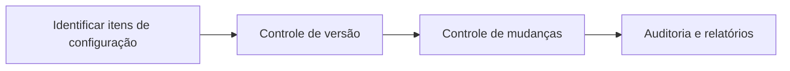
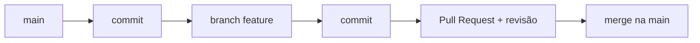
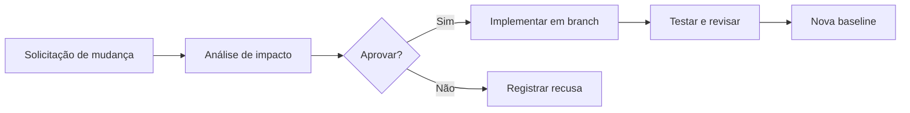
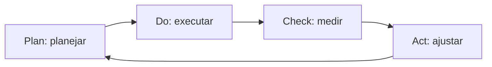

# Aula 12 — Gestão de Configuração, Manutenção e Reengenharia

!!! info "Objetivos da aula"
    - Entender **Gestão de Configuração de Software (GCS)** e **controle de versão**.
    - Conhecer **baseline**, **controle de mudanças** e versionamento.
    - Diferenciar os **tipos de manutenção** de software.
    - Compreender **reengenharia** e **melhoria de processo**.

## Gestão de Configuração de Software (GCS)

Software muda o tempo todo. A **GCS** controla essas mudanças para que a equipe
sempre saiba **o que** mudou, **quando**, **por quê** e **por quem** — e consiga
voltar atrás. É a disciplina que evita o caos do "na minha máquina funcionava".

!!! note "Baseline"
    Uma **baseline** é uma versão **congelada e aprovada** dos artefatos (código,
    documentos). A partir dela, mudanças só entram por um processo controlado. É o
    ponto de referência estável do projeto.

## Controle de versão com Git

O **Git** é o sistema de controle de versão que você já usa nas listas. Ele
registra o **histórico** de mudanças e permite trabalho paralelo por **branches**.

| Conceito | O que é |
| :--- | :--- |
| **Commit** | uma mudança registrada com mensagem e autor |
| **Branch** | linha de trabalho paralela |
| **Merge** | juntar mudanças de uma branch em outra |
| **Tag** | marca uma versão (ex.: `v1.0.0`) — como uma baseline |

!!! tip "Versionamento semântico (SemVer)"
    Versões no formato **MAJOR.MINOR.PATCH** (ex.: `2.4.1`):

    - **MAJOR**: mudança incompatível.
    - **MINOR**: nova funcionalidade compatível.
    - **PATCH**: correção de defeito.

## Controle de mudanças

Nem toda mudança deve entrar na hora. Um fluxo típico de **requisição de mudança**:

## Manutenção de software

Manutenção é onde o software passa **a maior parte** de sua vida. Quatro tipos:

| Tipo | Motivo | Exemplo |
| :--- | :--- | :--- |
| **Corretiva** | corrigir defeitos | consertar um cálculo errado |
| **Adaptativa** | ambiente mudou | migrar para nova versão do SO/API |
| **Perfectiva** | melhorar/adicionar | deixar uma tela mais rápida |
| **Preventiva** | evitar problemas futuros | refatorar código frágil antes que quebre |

!!! warning "A maior fatia é perfectiva/adaptativa"
    Muita gente acha que manutenção é só "corrigir bug". Na prática, **evoluir** e
    **adaptar** o software costuma consumir mais esforço que corrigir defeitos.

## Reengenharia e conceitos relacionados

Quando o custo de manter um sistema legado fica alto demais, entra a
**reengenharia**: reconstruir para melhorar a estrutura **sem** mudar (muito) o
comportamento externo.

=== "Reengenharia"
    Reestruturar/reescrever um sistema legado para melhorar manutenibilidade,
    preservando a função. Ex.: modernizar um sistema em tecnologia obsoleta.

=== "Engenharia Reversa"
    Analisar um sistema existente para **entender** e recuperar seu projeto/documentação
    (do código para o modelo). Não altera o sistema.

=== "Refatoração"
    Melhorar a **estrutura interna** do código sem mudar seu comportamento,
    protegido por testes (Aula 07). É reengenharia "em pequena escala".

## Melhoria contínua do processo

Fecha o ciclo com os modelos da Aula 11: medir (Aula 10), identificar gargalos e
melhorar o processo de forma contínua — o espírito do nível mais alto do CMMI e do
MPS.BR. Um ciclo clássico é o **PDCA**:

## Exercícios

??? abstract "Exercício 1 — Tipo de manutenção"
    Classifique cada situação:

    1. O cliente pediu um novo relatório.
    2. Uma nova lei obriga a mudar o cálculo do imposto.
    3. Corrigir uma divisão por zero relatada por um usuário.
    4. Reescrever um módulo confuso antes que ele dê problema.

??? abstract "Exercício 2 — SemVer"
    Você lançou a versão `1.4.2`. Diga a próxima versão para: (a) uma correção de
    bug; (b) uma nova funcionalidade compatível; (c) uma mudança que quebra a API.

??? abstract "Exercício 3 — Reengenharia x reversa x refatoração"
    Explique, com um exemplo curto cada, a diferença entre **reengenharia**,
    **engenharia reversa** e **refatoração**.

!!! tip "Próxima Parada 🚀"
    Encerre o ciclo com a [**Lista 12 — Configuração e Manutenção**](../listas/12-lista.md).
    Parabéns por chegar até aqui — você percorreu toda a jornada da qualidade de
    software! 🎉
